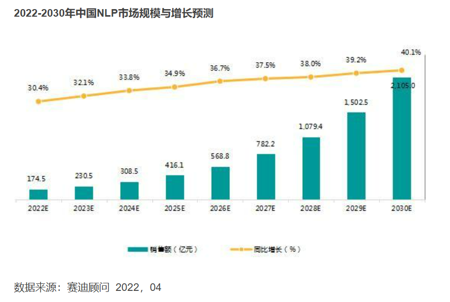

# Get-It 商业计划书

| 姓名   | 学号      |
| ------ | --------- |
| 熊丘桓 | 201250172 |
| 蔡之恒 | 201250127 |
| 王福森 | 201250181 |
| 孙立帆 | 201250185 |
| 张怡娜 | 191098336 |

[TOC]

## 执行摘要

<!-- 这部分最后完成，ddl=02-06 -->

### 市场分析摘要

### 产品与服务摘要

### 营销计划摘要

### 财务计划摘要

## 产品与服务

<!-- 开始画大饼？ddl=02-04 -->

### 产品概述：

### 技术实现

### 平台整体技术选型

### 平台架构设计

### 安全方面

### 网站运维

### 服务器

## 市场分析

<!-- 参考 Lab2-2，ddl=02-04 -->

### 宏观市场分析

#### 政治环境分析

随着中国国际影响力的不断提高和经济的不断发展，中国已经迈向了互联网世界，而网络时代下“失语症”现象愈发严重，但大众网民在工作和生活中又有对丰富的表达内容和形式、表达素材的需求，他们迫切需求一种能解决此矛盾的一个途径。

早在 2020 年国务院便发布了《国务院关于促进国家高新技术产业开发区高质量发展的若干意见》（以下简称《意见》）。《意见》提倡“发展高科技、实现产业化”，而本平台的核心便是以 NLP 等高新技术为基础的高质量图文推荐引擎。

为此，Get-It 团队针对现实需求并顺应国家政策推出 Get-It 平台。

#### 经济环境分析

全球经济未处于爆发期，相反，世界经济在 2022 年又遭受了数次冲击。随着经济下行风险显现，全球经济进一步放缓；通货膨胀逐渐加剧，货币政策进一步收紧；乌克兰战争的持续引发了广泛的困难；受到乌克兰战争的影响，其造成的粮食、能源等基础物资危机进一步影响了一部分国家的民众和经济状况。2022 年全球经济处于下行态势，市场趋于紧缩。尽管世界经济呈下行态势，但国内疫情逐渐控制，经济开始复苏，2022 年，党的 20 大召开，十四五规划全面落实。因此可以预测 2022 年国内经济虽然增速放缓，但仍然能呈现上升趋势。

预测 2022 年全球 GDP 增长率约为 2% 至 3% 之间，预测我国的 GDP 增长可能高于 3% ，但不会太多。这也印证了问题一中“世界经济下行，中国经济基本维持稳定”的观点。

2022 年，失业率仍未恢复到疫情之前水平，国内青年失业率偏高，这也说明了经济发展遇到一定困难。

受到疫情、俄乌冲突风险的影响，资本市场在 2022 年上半年逐渐呈紧缩状态，整体走势较弱。金融方面收紧，而能源、粮食等基础资源方面则呈现上升态势，这也符合世界政治态势。

作为人工智能（NLP）高技术产业，平台将要凭借核心技术打造支持系统。从调研结果和新闻报道看，平台以人工智能高精尖技术为卖点获得投资的可行性较大。尽管经济下行，人工智能作为新兴领域仍然具有光明的发展前途，获得投融资的可行性较大，获得这些投资的成本较低。

本平台比起传统的社区，更倾向于兴趣社区这样的“泛资讯”平台。2022 年传统社区平台（QQ、微信等）和部分兴趣平台（如虎扑等体育社区）发展困难，但本产品所携带的社区功能与这些产品不同，并不是聚焦于特定的兴趣领域，也不是为了维护关系的“熟人社交”模式，甚至有一点类似于百度贴吧。结合强大的搜索引擎推荐功能，平台的社区功能与常见产品均为不同。因此在社区类产品寻找投融资时或许可作为一个卖点，本平台几乎没有以上社区平台发展过程中的短板。因此在同类型产品获取投融资过程中可能存在部分优势。而在近期，仍有部分社交产品（比如“她说”）获得大量融资，因此小组成员认为从这个角度出发获取投融资仍具有较大的可能性。但由于信息不足，难以详细分析获取投资的成本。

此外，在 NLP 行业领域中，根据赛迪顾问数据显示（如下图），2026 年起中国 NLP 行业规模未来市场规模的增长将保持在 35% 以上的增速，行业市场呈现蓬勃发展的趋势。

#### 社会环境分析

##### 民众焦虑感增加

新冠疫情、IT 员工 996 工作制、经济萧条等等趋势都展现出国民的焦虑，他们急需一个合理合法的疏通焦虑的方式，为此可能为发的泄途径买单。我们的社区的 dark mode 就为网民提供了一个合理的发泄平台。

##### 开源精神盛行

开源的精神让用户更加乐意发布自己寻找到的高质量图文，共同创造一个更加优质、更加全面的图文分享社区，便利更多人。

#### 技术环境分析

平台基于目前蓬勃发展的 AI、NLP、互联网技术进行开发，在技术储备上已经很充足，主要分为以下几个部分。

##### 稳定流畅且对用户友好的客户端

本平台基于成熟的前后端开发技术、采用微服务架构，并且通过容灾备份技术保证服务器的稳定性、通过 Redis 缓存技术提升客户端用户使用的流畅度、通过前端工程师精心设计保证用户体验感。

##### 精准快速的搜索引擎

本平台基于成熟的 NLP 技术自研一套高质量图文推荐搜索引擎，保证用户在本平台搜索高质量图文能做到即精准又快速，同时还能给用户意料之外但情理之中的结果。

##### 不断扩充的图文数据库

本平台上线后将通过与第三方企业合作、平台社区用户贡献、本平台相关人员搜集等方式不断扩充图文数据库，用以提供全方面、多角度、高质量的图文，最终提升用户使用平台搜索引擎的体验感。

##### 主流的付费途径

本平台使用微信、支付宝、银联等主流第三方支付服务，搭建起基于平台的积分和会员机制的收费体制，保证用户的消费过程畅通无阻。

### 中观市场分析

### 微观市场分析

#### 优势分析

##### 符合政治趋势

《意见》的发表证明了国家对于 Get-It 平台这样的高新技术产业结晶的大力赞扬。Get-It 平台通过高效精准的 NLP 智能推荐算法，为用户提供高质量图文搜索功能，呈现用户所想、“读懂”用户内心。

##### 平台涉众广

本产品面向日常网络交流者、宣传工作者、书面写作者、其他通俗交流者，目标用户年龄为 6~80 岁，覆盖大部分中国人口。

##### 直击当下社会问题

疫情催生出了大量心理服务需求，产品可以帮助疏导用户情绪。

##### 盘活现有资源

当前版权市场有“垄断”无市，我们的产品可以连接版权方和需求方，盘活现有资源，充分发挥版权市场潜力。

##### 核心资源的排他性

  在业务领域内，我们依托核心资源设计的商业模式新颖，在行业内尚无大规模应用，在我们的产品服务取得开拓性进展后，竞争对手难以复制我们的核心资源。

##### 专注本领域

我们的合作伙伴跨越了社交媒体、自媒体平台、素材资源版权方、云服务提供方等多个领域，依托各自在领域内的成熟运营模式，我们可以减少大量的边缘工作，以期将精力和人力资源集中在最重要的业务上。同时，大多数合作伙伴能够和我们相互协调工作，推进关键业务的进展；另外，我们的合作伙伴与我们的商业联系较为紧密，不容易转而离开或与我们的竞争对手合作。

#### 机会与威胁分析

##### 机会

###### 核心资源可复用

平台自研的 AI 搜索引擎推荐算法仍有未被发掘的潜力，将来如果此算法能为平台吸引大量用户，平台则可以考虑将其作为产品的一部分，对其他 IT 公司提供搜索引擎推荐服务；除此之外平台的社区资源也是一个巨大的潜力，平台可以充分利用社区资源为其他公司引流，从中获利；也可以扩充平台的功能，不止聚焦于优质图文，让社区用户自由交流，调动用户的积极性。

###### 业务标准化提高效率

平台的开发、维护和升级可以用软件工程过程方法制定标准化的流程进行高效管理，降低开发成本；平台的监管也需要制定一个标准化的流程，当用户在平台发表内容之后，监管部门应当顺着流程一步一步审查，维护平台的纯净与合法性。用户的反馈跟进小组从收集反馈到调研，再到落实反馈也应当遵循相应流程，保障该活动的有序性，提高反馈部门的工作效率。

###### 与合作伙伴更深入地合作

  平台通过与云服务平台合作、与图文版权所有者合作可以减轻平台运维压力，降低素材资源积累成本，如此使得平台可以将更多的资源集中于搜索引擎开发与优化等核心业务的展开。

###### 国内 NLP 产业形式向好

《意见》的颁发体现国家开始重视高新技术产业。同时，随着中国经济的崛起，受到西方资本主义国家在尖端科技上的“卡脖子”，中国势必不能坐以待毙。可以预见到，未来中国政府对高新技术产业的投入将日益加大，Get-It 平台所属的 NLP 产业的市场前景一片光明。

##### 潜在威胁

###### 可能面临素材与人力资源短缺

我们产品和服务相关的核心资源中，可能产生短缺的是素材资源和人力资源。在社区建设初期需要进行高质量图文素材资源的迭代积累，这一部分除了版权方之外还需要社区用户的积极参与，但是这在初期可以通过给用户激励来缓解；同时，中国的老龄化程度逐渐加深，人口红利迎来尾声，劳动力成本逐渐攀升，这意味着我们可能面临高水平研发人员的短缺。

###### 工作成本过大

除了 IT 资源的外包外，我们自己承担了大多数的工作，这样的工作量需要相当成本的人力资源和足够高效的运营管理手段。

###### 资源需求不可预测

资源的需求主要受到互联网大环境和政治经济文化社会变迁的影响，对宏观社会的整体把握较为困难；但当我们提供的产品服务对流行网络环境造成相当的影响之后，可以创造出新的局部流行环境。

## 营销计划

<!-- 从以往的作业当中整理，ddl=02-04 -->

### 双管齐下营销

### 宣传推广创意

### 具体产品平台开发及推广营销计划

## 团队介绍

<!-- 自行整理，ddl=01-29 -->

### 团队名称

### 成员名单

### 成员介绍

## 投资估算与资金运用

### 投资预测

### 融资方案

### 资本退出方式

## 财务计划与预测

### 财务分析假设

### 成本预估

### 投资收益

## 风险与控制

### 项目实施风险

### 应对措施