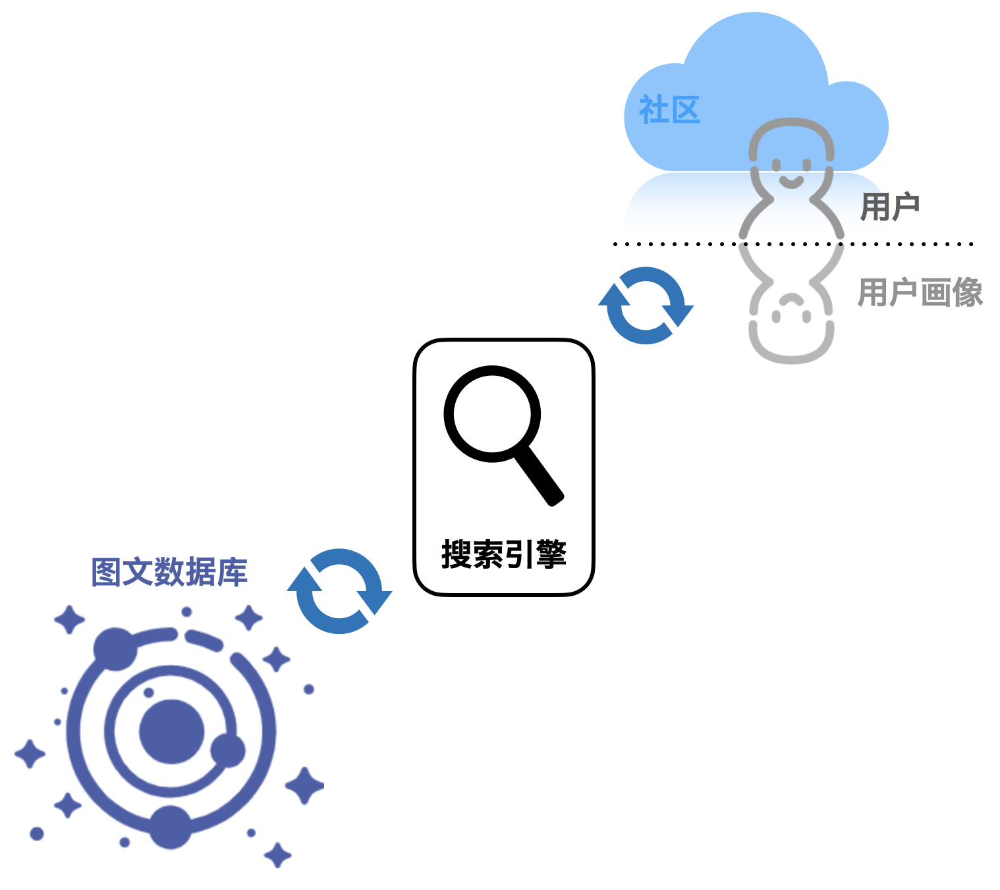

# Get-It 商业计划书

| 姓名   | 学号      |
| ------ | --------- |
| 熊丘桓 | 201250172 |
| 蔡之恒 | 201250127 |
| 王福森 | 201250181 |
| 孙立帆 | 201250185 |
| 张怡娜 | 191098336 |

[TOC]

## 执行摘要

<!-- 这部分最后完成，ddl=02-06 -->

### 市场分析摘要

### 产品与服务摘要

### 营销计划摘要

### 财务计划摘要

## 产品与服务

<!-- 开始画大饼？ddl=02-04 -->

### 产品概述：所思所想，触手可得

网络时代，“失语症”现象愈发严重。为方便用户丰富表达内容和形式、获取表达素材和手段，创业小组致力于研发的 Get-It 项目以高质量的图文推荐引擎为核心，以社区功能和其他实用小工具为辅助，希望帮助用户破除“现代失语症”的限制。

本产品致力于打造一个高质量的图文素材社区，致力于为每一个图文素材的寻求者和提供者创造一个温馨的“家”。全球各地的爱好者在互联网时代下通过 Get-It 平台的社区连结，接受知识、创造知识、分享知识。图片和语言的魅力在社区中展现，这一份魅力也将通过现代的自然语言处理和推荐技术，惠及千千万万受到“现代失语症”困扰的“打工人”。无论是在为朋友圈寻找优质的文案、漂亮的配图，还是在为 Pre 寻找合适的素材，Get-It 平台的搜索推荐引擎都可以轻松解决。

本产品还致力于打造一个包罗万象的网络“梗百科”及一个支撑社区（**Dark Mode**），在此基础上开发诸如“抽象转换器”等有趣有意义的小工具。Dark Mode 社区新潮前卫，用户聊天轻松写意，可以有效释放现代社会快节奏的生活压力。网络时代，语义更迭迅速、新梗频繁涌现，Dark Mode 社区沉淀其糟粕、提炼其精华，一套不断更迭的“梗百科”将为大量渴望融入年轻思潮的人群提供最及时的帮助，也希望人们在此收获快乐。

所思所想，触手可得。Get-It 平台将持续为展现图文魅力、破局网络时代“失语症”而不懈努力。

### 服务细节

平台的绝对核心是一款高质量的图文推荐引擎，用户输入想要表达的内容、主题、关键字，推荐引擎通过智能 AI 算法，推荐高质量的图片或文字。为帮助用户精准定位需求，平台分别制作文字推荐和图片推荐页面，用户还可部分自定义内容倾向性。例如，在文字推荐引擎中，用户输入一个意象，平台可能会智能推荐相应的诗词、名著文段、名人名言等；在图片推荐引擎中，用户输入一个主题，平台可能会推荐相应的图标（icon）、表情包、矢量图等。平台推荐结果主打高质量，期望推荐的结果可以直接用于朋友圈文案、幻灯片制作、公文写作等场合。

沟通与理解是双向的，用户在输出自身观点的同时也在输入他人的观点。为增进理解，平台整合以上搜索功能，推出“一键搜索”功能。用户面对晦涩难懂的文字甚至是词不达意的表达，只需键入关键字，平台就会智能推荐近似的文本和图片，促进用户的理解。

今天，造梗和玩梗的速度已达到高峰，为了拓宽用户面、紧跟潮流、保持推荐引擎的时效性，平台也融入了社区模块。该功能可分为两部分，一部分类似于 Wikipedia，鼓励用户提供资源参与平台建设；另一部分则类似于微博或推特，为用户提供一个分享生活的平台。良好的社区氛围会反哺于平台的推广，高素质的用户也会让平台受益良多。两个模块相辅相成，对平台的建立、发展和巩固会起到不可替代的作用。

现代生活，紧张压抑，缺少自由，人们内心积压的情绪无处释放，于是百度贴吧等网络论坛便成为言论“垃圾场”，网络时代聊天抽象程度提高，为了增进用户对新型网络梗的理解，引导用户合理发泄情绪，满足用户一些猎奇、变态却不违背公序良俗的心理，平台特别推出**暗黑模式（Dark Mode）**。

在暗黑模式（Dark Mode）下，搜索引擎的推荐内容从正派、高雅的素材一转变为开放、重口的素材，以满足用户相互理解、网络斗图等需要。平台还计划推出一个工具集（功能待完善），目前包含抽象转换器，可以进行抽象文本和正常文本的双向转化。比如，用户输入 “别在这里发电”，抽象转换器就会输出 “🐢💈”。图片推荐引擎还可推荐二次元图片、重口表情包、emoji 等内容；文字推荐引擎则可推荐网络梗、二次元梗等内容。暗黑模式的社区或许可以称得上“群魔乱舞”，只要不违法或违背公序良俗，用户可在其中畅所欲言。

为了保证纯净模式（Light Mode）（即上文介绍的内容，与暗黑模式相对）的质量，平台会加强监管，防止不合适的内容流入纯净模式的社区。

我们的项目中，**纯净模式**致力于进行高质量素材的内容收集和信息整合，提高用户收集图文素材的效率，为用户能够理解他人、表达心中所想提供支持；**暗黑模式**以同一套技术为网络时代用户适应语言惊人的迭代速度提供支持，引导用户合理发泄情绪。平台始终将帮助用户解决“失语症”放在第一位，为让用户自信说出“I got it” 而不懈努力。

### 技术实现

无论是 Light Mode ，还是 Dark Mode ，所采取的推荐算法大同小异，以下将以 Light Mode 为例，简要介绍 Get-It 平台采取的图文搜索推荐算法。

无论是文段还是图片，Get-It 平台所采用的引擎都将其扁平化为标签（tag） - 评分（score）的形式。标签的生成过程采取人工标注和自然语言处理 / 图像识别技术结合的形式，而评分则是根据基础评分和搜索过程中体现的信息动态更新。有了标签和评分，Get-It 平台的处理引擎将其连接为知识图谱的形式，这可以理解为一种新的编码，将有利于提高查询的效率。

除去构建图文数据库（知识图谱）之外，平台还将为每个用户定制用户画像，该用户画像将包含使用偏好和素材倾向，但不会收集用户其他的隐私信息。平台可以依此为每个用户定制高质量的、具有偏向性的推荐结果，用户也可以自己在搜索的时候添加偏好以修正搜索引擎的行为。

在一次具体的搜索发生之后，Get-It 平台将会更新图文素材的评分以及用户画像。这种动态维护的过程将为平台的高质量推荐服务提供长期、稳定的保障。

### 网站运维

有了强大的技术引擎，网站运维方面的工作可以称得上是较为简单，大量成功项目珠玉在前。Get-It 平台在正式上线时将采取主流技术框架，采用数据库与前后端分离技术，合理估算日流量与并发数，并与主流云服务公司合作。Get-It 平台将采取主流、稳定的策略与技术，保证网站的平稳运行。

## 市场分析

<!-- 参考 Lab2-2，ddl=02-04 -->

### 宏观市场分析

### 中观市场分析

### 微观市场分析

## 营销计划

<!-- 从以往的作业当中整理，ddl=02-04 -->

### 双管齐下营销

### 宣传推广创意

### 具体产品平台开发及推广营销计划

## 团队介绍

<!-- 自行整理，ddl=01-29 -->

### 团队名称

### 成员名单

### 成员介绍

## 投资估算与资金运用

### 投资预测

### 融资方案

### 资本退出方式

## 财务计划与预测

### 财务分析假设

### 成本预估

### 投资收益

## 风险与控制

### 项目实施风险

### 应对措施