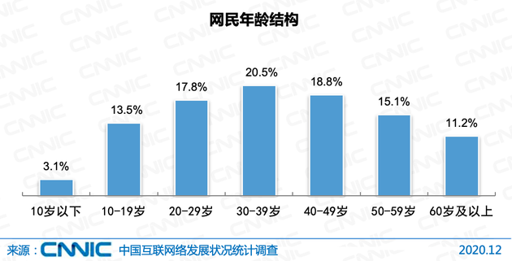
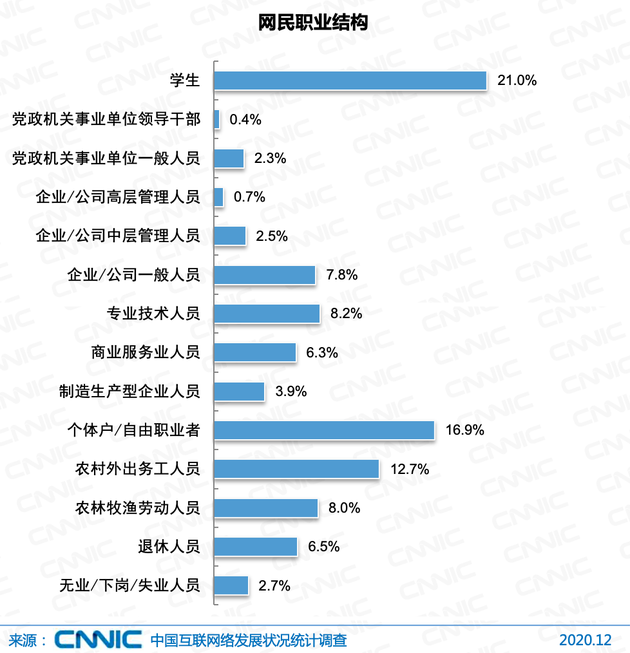

# Get-It 商业计划书

| 姓名   | 学号      |
| ------ | --------- |
| 熊丘桓 | 201250172 |
| 蔡之恒 | 201250127 |
| 王福森 | 201250181 |
| 孙立帆 | 201250185 |
| 张怡娜 | 191098336 |

[TOC]

## 执行摘要

<!-- 这部分最后完成，ddl=02-06 -->

### 市场分析摘要

### 产品与服务摘要

### 营销计划摘要

### 财务计划摘要

## 产品与服务

<!-- 开始画大饼？ddl=02-04 -->

### 产品概述：

### 技术实现

### 平台整体技术选型

### 平台架构设计

### 安全方面

### 网站运维

### 服务器

## 市场分析

<!-- 参考 Lab2-2，ddl=02-04 -->

### 宏观市场分析

### 中观市场分析

#### 行业特征分析

##### 日常网络交流者的用户特征

1. 年龄画像

   根据 《中国互联网络发展状况统计报告》，截至2020年12月，20-29岁、30-39岁、40-49岁网民占比分别为17.8%、20.5%和18.8%，高于其他年龄段群体；50岁及以上网民群体占比由2020年3月的16.9%提升至26.3%，互联网进一步向中老年群体渗透。并且，相比于年轻一代，中老年人由于身处的环境和自身经历原因，在接触到年轻一代的网络环境时，更容易遭受 "网络失语症" 的问题；年轻一代由于从小生长于互联网的环境，"网络失语症" 的问题相对较小，但也存在一定程度的需求。

   

2. 城市画像

   根据数据显示，2021年我国互联网用户在三线城市中所占比重最高，高达24.90%，其次为四线城市和二线城市，所占比重分别为20.10%、17.60%。一线城市的用户经济基础较好，付费意愿一般较强，但是二三四线城市网民基数大，需求也因此较大。

3. 职业画像

   根据 《中国互联网络发展状况统计报告》，截至2020年12月，在我国网民群体中，学生最多，占比为21.0%；其次是个体户/自由职业者，占比为16.9%；农林牧渔劳动人员占比为8.0%。作为日常网络交流者这一身份来说，学生以及个体户/自由职业者这两个群体不仅占有较大的份额，也拥有较大的网络表达欲，因此也是需求较为集中的两个群体。

   

##### 日常网络交流者的困难

1. 在网络空间交流时对于某些网络用语的困惑。
2. 在网络空间交流时难以准确地或者"体面"地表达自己想要表达的意思。

##### 宣传工作者的用户特征

1. 年龄画像

   我国的宣传工作者从业人数超过 260 万，从业人员主要以 30 岁以下的年轻人为主。这是符合时代潮流的，因为年轻人对目前大家更容易接受的表达方式更为熟悉，往往能取得更好的效果。

2. 职业画像

   我国的宣传工作者主要包括自媒体从业者和企业的宣传工作者，其中自媒体从业者由于其低门槛，人数日渐增加。

##### 宣传工作者的困难

1. 统计表明，我国自媒体从业人员超八成从业年限低于两年。这部分群体中的许多人在入行初期由于经验不足常常难以生成质量高的内容。
2. 在合适的场合需要配以合适的内容也是不少宣传工作者遇到的困难之一。比如企业的宣传工作者在某些正式的场合配以的图文就需要比较正式或者严肃，但是日常的自媒体人则需要轻快有趣，在不同的场合中合适的挑选内容并非易事。
3. 互联网上的素材浩如烟海，往往需要宣传工作者花费大量时间来检索挑选，这加重了他们工作的难度，降低了效率。

##### 书面写作者的用户特征

1. 职业画像

   我国秘书行业从业人员已经超过 2000 万，但是 80% 以上的秘书没有受过专门培训。职场上的秘书分为三个层级，普通秘书收入为 2000-4000 元，总经理秘书约 5000 元，而外企公司总裁办公室高级秘书的月薪大约在 8000 元到 1万元之间。

##### 书面写作者的困难

1. 目前书面工作者普遍没有接受过专门的培训，文笔功底有待提升，素材收集能力也有发展空间。初级的书面写作者在入门阶段进步缓慢，职业发展道路受限。

#### 现有竞争者和替代者分析

#### 供应商与购买者分析

### 微观市场分析

## 营销计划

<!-- 从以往的作业当中整理，ddl=02-04 -->

### 双管齐下营销

### 宣传推广创意

### 具体产品平台开发及推广营销计划

## 团队介绍

<!-- 自行整理，ddl=01-29 -->

### 团队名称

### 成员名单

### 成员介绍

## 投资估算与资金运用

### 投资预测

### 融资方案

### 资本退出方式

## 财务计划与预测

### 财务分析假设

### 成本预估

### 投资收益

## 风险与控制

### 项目实施风险

### 应对措施