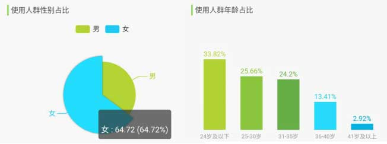

# Get-It 图文表达素材共享平台 商业计划书

【2023 年大学生创新训练计划】

|  姓名  |   学号    |      院系      |   专业   |     年级      |
| :----: | :-------: | :------------: | :------: | :-----------: |
| 熊丘桓 | 201250172 |    软件学院    | 软件工程 | 2020 级本科生 |
| 蔡之恒 | 201250127 |    软件学院    | 软件工程 | 2020 级本科生 |
| 王福森 | 201250181 |    软件学院    | 软件工程 | 2020 级本科生 |
| 孙立帆 | 201250185 |    软件学院    | 软件工程 | 2020 级本科生 |
| 张怡娜 | 191098336 | 商学院经济学院 | 产业经济 | 2019 级本科生 |

2023 年 2 月 1 日

[TOC]

## 执行摘要

### 产品与服务摘要

为助力破局网络时代“失语症”，创业小组致力于研发的 Get-It 项目以高质量的图文推荐引擎为核心，以社区功能和其他实用小工具为辅助，希望打造一个图文素材检索推荐和分享互助平台，展现文字和图片的魅力，并希望借助新一代自然语言处理/图像识别技术将海量优质图文素材精准地推荐给相应的通俗交流者。在此过程中，Get-It 平台希望通过合理的会员费、使用费来维护社区平稳运行并支持最新技术的研发，倡导知识共享，体现技术价值。

### 市场分析摘要

如今大众处于网络时代，手机电脑强大的输入法和网络上丰富的图文素材资源让大众忽视了对自身遣词造句、说出优雅、得体的话的能力。但随着互联网的飞速发展，如今已经进入信息过剩的时代，大众不再能够轻易地从网络上获得他们想要的高质量图片和诗歌文字，而被大量垃圾信息裹挟。大众一没自身储备，二又需要花费大量精力才能从网上搜得少量资源，其“失语症”愈发严重。

早在 2020 年国务院便发布了《国务院关于促进国家高新技术产业开发区高质量发展的若干意见》。国家提倡“发展高科技、实现产业化”。因此，通过 NLP 等高新技术解决大众网民“失语症”的现实需求成为可能。本产品聚焦于此，面向日常网络交流者、宣传工作者、书面写作者、其他通俗交流者，通过以高质量的图文推荐引擎为核心，以社区功能和其他实用小工具为辅助，方便他们丰富表达内容和形式、获取表达素材与手段，希望帮助他们破除“现代失语症”的限制。

### 营销计划摘要

学生和青年宣传工作者是本产品的重要受众，且这些群体对互联网依存度高。因此本产品将采用自有渠道营销和合作方营销双管齐下的营销方式，并将校园和新媒体领域作为营销的重点。本产品整体发展过程拟分为三个阶段：第一阶段（南京大学试点期）、第二阶段（项目过渡期）和第三阶段（项目成熟期）。

### 财务计划摘要

在项目运行前期，每年产生的成本预计为 80 万元左右，营收逐将逐年增加，预计在第二年扭亏为盈，此后将实现净利润的稳步增长，获得可观的投资收益。主要资金来源为银行贷款、自筹资金和外部投资，其中债务资本占比将逐步上升，提高投资回报率。项目也面临着开发迟滞、成本上涨、资金不足以及舆论监管等风险，为此，我们制定了有针对性的风险应对方案，以确保项目在未来的良好运转。

## 产品与服务

### 产品概述：所思所想，触手可得

网络时代，“失语症”现象愈发严重。为方便用户丰富表达内容和形式、获取表达素材和手段，创业小组致力于研发的 Get-It 项目以高质量的图文推荐引擎为核心，以社区功能和其他实用小工具为辅助，希望帮助用户破除“现代失语症”的限制。

本产品致力于打造一个高质量的图文素材社区，致力于为每一个图文素材的寻求者和提供者创造一个温馨的“家”。全球各地的爱好者在互联网时代下通过 Get-It 平台的社区连结，接受知识、创造知识、分享知识。图片和语言的魅力在社区中展现，这一份魅力也将通过现代的自然语言处理和推荐技术，惠及千千万万受到“现代失语症”困扰的“打工人”。无论是在为朋友圈寻找优质的文案、漂亮的配图，还是在为 Pre 寻找合适的素材，Get-It 平台的搜索推荐引擎都可以轻松解决。

本产品还致力于打造一个包罗万象的网络“梗百科”及一个支撑社区（Dark Mode），在此基础上开发诸如“抽象转换器”等有趣有意义的小工具。Dark Mode 社区新潮前卫，用户聊天轻松写意，可以有效释放现代社会快节奏的生活压力。网络时代，语义更迭迅速、新梗频繁涌现，Dark Mode 社区沉淀其糟粕、提炼其精华，一套不断更迭的“梗百科”将为大量渴望融入年轻思潮的人群提供最及时的帮助，也希望人们在此收获快乐。

所思所想，触手可得。Get-It 平台将持续为展现图文魅力、破局网络时代“失语症”而不懈努力。

### 服务细节

平台的绝对核心是一款高质量的图文推荐引擎，用户输入想要表达的内容、主题、关键字，推荐引擎通过智能 AI 算法，推荐高质量的图片或文字。为帮助用户精准定位需求，平台分别制作文字推荐和图片推荐页面，用户还可部分自定义内容倾向性。例如，在文字推荐引擎中，用户输入一个意象，平台可能会智能推荐相应的诗词、名著文段、名人名言等；在图片推荐引擎中，用户输入一个主题，平台可能会推荐相应的图标（icon）、表情包、矢量图等。平台推荐结果主打高质量，期望推荐的结果可以直接用于朋友圈文案、幻灯片制作、公文写作等场合。

沟通与理解是双向的，用户在输出自身观点的同时也在输入他人的观点。为增进理解，平台整合以上搜索功能，推出“一键搜索”功能。用户面对晦涩难懂的文字甚至是词不达意的表达，只需键入关键字，平台就会智能推荐近似的文本和图片，促进用户的理解。

今天，造梗和玩梗的速度已达到高峰，为了拓宽用户面、紧跟潮流、保持推荐引擎的时效性，平台也融入了社区模块。该功能可分为两部分，一部分类似于 Wikipedia，鼓励用户提供资源参与平台建设；另一部分则类似于微博或推特，为用户提供一个分享生活的平台。良好的社区氛围会反哺于平台的推广，高素质的用户也会让平台受益良多。两个模块相辅相成，对平台的建立、发展和巩固会起到不可替代的作用。

现代生活，紧张压抑，缺少自由，人们内心积压的情绪无处释放，于是百度贴吧等网络论坛便成为言论“垃圾场”，网络时代聊天抽象程度提高，为了增进用户对新型网络梗的理解，引导用户合理发泄情绪，满足用户一些猎奇、变态却不违背公序良俗的心理，平台特别推出**暗黑模式（Dark Mode）**。

在暗黑模式（Dark Mode）下，搜索引擎的推荐内容从正派、高雅的素材一转变为开放、重口的素材，以满足用户相互理解、网络斗图等需要。平台还计划推出一个工具集（功能待完善），目前包含抽象转换器，可以进行抽象文本和正常文本的双向转化。比如，用户输入 “别在这里发电”，抽象转换器就会输出 “🐢💈”。图片推荐引擎还可推荐二次元图片、重口表情包、emoji 等内容；文字推荐引擎则可推荐网络梗、二次元梗等内容。暗黑模式的社区或许可以称得上“群魔乱舞”，只要不违法或违背公序良俗，用户可在其中畅所欲言。

为了保证纯净模式（Light Mode）（即上文介绍的内容，与暗黑模式相对）的质量，平台会加强监管，防止不合适的内容流入纯净模式的社区。

我们的项目中，**纯净模式**致力于进行高质量素材的内容收集和信息整合，提高用户收集图文素材的效率，为用户能够理解他人、表达心中所想提供支持；**暗黑模式**以同一套技术为网络时代用户适应语言惊人的迭代速度提供支持，引导用户合理发泄情绪。平台始终将帮助用户解决“失语症”放在第一位，为让用户自信说出“I got it” 而不懈努力。

### 技术实现

无论是 Light Mode ，还是 Dark Mode ，所采取的推荐算法大同小异，以下将以 Light Mode 为例，简要介绍 Get-It 平台采取的图文搜索推荐算法。

无论是文段还是图片，Get-It 平台所采用的引擎都将其扁平化为标签（tag） - 评分（score）的形式。标签的生成过程采取人工标注和自然语言处理 / 图像识别技术结合的形式，而评分则是根据基础评分和搜索过程中体现的信息动态更新。有了标签和评分，Get-It 平台的处理引擎将其连接为知识图谱的形式，这可以理解为一种新的编码，将有利于提高查询的效率。

除去构建图文数据库（知识图谱）之外，平台还将为每个用户定制用户画像，该用户画像将包含使用偏好和素材倾向，但不会收集用户其他的隐私信息。平台可以依此为每个用户定制高质量的、具有偏向性的推荐结果，用户也可以自己在搜索的时候添加偏好以修正搜索引擎的行为。

在一次具体的搜索发生之后，Get-It 平台将会更新图文素材的评分以及用户画像。这种动态维护的过程将为平台的高质量推荐服务提供长期、稳定的保障。

### 网站运维

有了强大的技术引擎，网站运维方面的工作可以称得上是较为简单，大量成功项目珠玉在前。Get-It 平台在正式上线时将采取主流技术框架，采用数据库与前后端分离技术，合理估算日流量与并发数，并与主流云服务公司合作。Get-It 平台将采取主流、稳定的策略与技术，保证网站的平稳运行。

## 市场分析

### 宏观市场分析

#### 政治环境分析

随着中国国际影响力的不断提高和经济的不断发展，中国已经迈向了互联网世界，而网络时代下“失语症”现象愈发严重，但大众网民在工作和生活中又有对丰富的表达内容和形式、表达素材的需求，他们迫切需求一种能解决此矛盾的一个途径。

早在 2020 年国务院便发布了《国务院关于促进国家高新技术产业开发区高质量发展的若干意见》（以下简称《意见》）。《意见》提倡“发展高科技、实现产业化”，而本平台的核心便是以 NLP 等高新技术为基础的高质量图文推荐引擎。

为此，Get-It 团队针对现实需求并顺应国家政策推出 Get-It 平台。

#### 经济环境分析

全球经济未处于爆发期，相反，世界经济在 2022 年又遭受了数次冲击。随着经济下行风险显现，全球经济进一步放缓；通货膨胀逐渐加剧，货币政策进一步收紧；乌克兰战争的持续引发了广泛的困难；受到乌克兰战争的影响，其造成的粮食、能源等基础物资危机进一步影响了一部分国家的民众和经济状况。2022 年全球经济处于下行态势，市场趋于紧缩。尽管世界经济呈下行态势，但国内疫情逐渐控制，经济开始复苏，2022 年，党的 20 大召开，十四五规划全面落实。因此可以预测 2022 年国内经济虽然增速放缓，但仍然能呈现上升趋势。

预测 2022 年全球 GDP 增长率约为 2% 至 3% 之间，预测我国的 GDP 增长可能高于 3% ，但不会太多。这也印证了问题一中“世界经济下行，中国经济基本维持稳定”的观点。

2022 年，失业率仍未恢复到疫情之前水平，国内青年失业率偏高，这也说明了经济发展遇到一定困难。

受到疫情、俄乌冲突风险的影响，资本市场在 2022 年上半年逐渐呈紧缩状态，整体走势较弱。金融方面收紧，而能源、粮食等基础资源方面则呈现上升态势，这也符合世界政治态势。

作为人工智能（NLP）高技术产业，平台将要凭借核心技术打造支持系统。从调研结果和新闻报道看，平台以人工智能高精尖技术为卖点获得投资的可行性较大。尽管经济下行，人工智能作为新兴领域仍然具有光明的发展前途，获得投融资的可行性较大，获得这些投资的成本较低。

本平台比起传统的社区，更倾向于兴趣社区这样的“泛资讯”平台。2022 年传统社区平台（QQ、微信等）和部分兴趣平台（如虎扑等体育社区）发展困难，但本产品所携带的社区功能与这些产品不同，并不是聚焦于特定的兴趣领域，也不是为了维护关系的“熟人社交”模式，甚至有一点类似于百度贴吧。结合强大的搜索引擎推荐功能，平台的社区功能与常见产品均为不同。因此在社区类产品寻找投融资时或许可作为一个卖点，本平台几乎没有以上社区平台发展过程中的短板。因此在同类型产品获取投融资过程中可能存在部分优势。而在近期，仍有部分社交产品（比如“她说”）获得大量融资，因此小组成员认为从这个角度出发获取投融资仍具有较大的可能性。但由于信息不足，难以详细分析获取投资的成本。

此外，在 NLP 行业领域中，根据赛迪顾问数据显示（如下图），2026 年起中国 NLP 行业规模未来市场规模的增长将保持在 35% 以上的增速，行业市场呈现蓬勃发展的趋势。

#### 社会环境分析

##### 民众焦虑感增加

新冠疫情、IT 员工 996 工作制、经济萧条等等趋势都展现出国民的焦虑，他们急需一个合理合法的疏通焦虑的方式，为此可能为发的泄途径买单。我们的社区的 dark mode 就为网民提供了一个合理的发泄平台。

##### 开源精神盛行

开源的精神让用户更加乐意发布自己寻找到的高质量图文，共同创造一个更加优质、更加全面的图文分享社区，便利更多人。

#### 技术环境分析

平台基于目前蓬勃发展的 AI、NLP、互联网技术进行开发，在技术储备上已经很充足，主要分为以下几个部分。

##### 稳定流畅且对用户友好的客户端

本平台基于成熟的前后端开发技术、采用微服务架构，并且通过容灾备份技术保证服务器的稳定性、通过 Redis 缓存技术提升客户端用户使用的流畅度、通过前端工程师精心设计保证用户体验感。

##### 精准快速的搜索引擎

本平台基于成熟的 NLP 技术自研一套高质量图文推荐搜索引擎，保证用户在本平台搜索高质量图文能做到即精准又快速，同时还能给用户意料之外但情理之中的结果。

##### 不断扩充的图文数据库

本平台上线后将通过与第三方企业合作、平台社区用户贡献、本平台相关人员搜集等方式不断扩充图文数据库，用以提供全方面、多角度、高质量的图文，最终提升用户使用平台搜索引擎的体验感。

##### 主流的付费途径

本平台使用微信、支付宝、银联等主流第三方支付服务，搭建起基于平台的积分和会员机制的收费体制，保证用户的消费过程畅通无阻。

### 中观市场分析

#### 行业特征分析

##### 日常网络交流者的用户特征

1. 年龄画像：根据 《中国互联网络发展状况统计报告》，截至 2020 年 12 月，20-29 岁、30-39 岁、40-49 岁网民占比分别为 17.8%、20.5% 和 18.8%，高于其他年龄段群体；50 岁及以上网民群体占比由 2020 年 3 月的 16.9% 提升至 26.3%，互联网进一步向中老年群体渗透。并且，相比于年轻一代，中老年人由于身处的环境和自身经历原因，在接触到年轻一代的网络环境时，更容易遭受 "网络失语症" 的问题；年轻一代由于从小生长于互联网的环境，"网络失语症" 的问题相对较小，但也存在一定程度的需求。

	

2. 城市画像：根据数据显示，2021 年我国互联网用户在三线城市中所占比重最高，高达 24.90%，其次为四线城市和二线城市，所占比重分别为 20.10%、17.60%。一线城市的用户经济基础较好，付费意愿一般较强，但是二三四线城市网民基数大，需求也因此较大。

3. 职业画像：根据 《中国互联网络发展状况统计报告》，截至 2020 年 12 月，在我国网民群体中，学生最多，占比为 21.0%；其次是个体户/自由职业者，占比为 16.9%；农林牧渔劳动人员占比为 8.0%。作为日常网络交流者这一身份来说，学生以及个体户/自由职业者这两个群体不仅占有较大的份额，也拥有较大的网络表达欲，因此也是需求较为集中的两个群体。

	

##### 日常网络交流者的困难

1. 在网络空间交流时对于某些网络用语的困惑。
2. 在网络空间交流时难以准确地或者"体面"地表达自己想要表达的意思。

##### 宣传工作者的用户特征

1. 年龄画像：我国的宣传工作者从业人数超过 260 万，从业人员主要以 30 岁以下的年轻人为主。这是符合时代潮流的，因为年轻人对目前大家更容易接受的表达方式更为熟悉，往往能取得更好的效果。

2. 职业画像：我国的宣传工作者主要包括自媒体从业者和企业的宣传工作者，其中自媒体从业者由于其低门槛，人数日渐增加。

##### 宣传工作者的困难

1. 统计表明，我国自媒体从业人员超八成从业年限低于两年。这部分群体中的许多人在入行初期由于经验不足常常难以生成质量高的内容。
2. 在合适的场合需要配以合适的内容也是不少宣传工作者遇到的困难之一。比如企业的宣传工作者在某些正式的场合配以的图文就需要比较正式或者严肃，但是日常的自媒体人则需要轻快有趣，在不同的场合中合适的挑选内容并非易事。
3. 互联网上的素材浩如烟海，往往需要宣传工作者花费大量时间来检索挑选，这加重了他们工作的难度，降低了效率。

##### 书面写作者的用户特征

职业画像：我国秘书行业从业人员已经超过 2000 万，但是 80% 以上的秘书没有受过专门培训。职场上的秘书分为三个层级，普通秘书收入为 2000-4000 元，总经理秘书约 5000 元，而外企公司总裁办公室高级秘书的月薪大约在 8000 元到 1 万元之间。

##### 书面写作者的困难

目前书面工作者普遍没有接受过专门的培训，文笔功底有待提升，素材收集能力也有发展空间。初级的书面写作者在入门阶段进步缓慢，职业发展道路受限。

#### 现有竞争者和替代者分析

| 产品名称  | 产品描述                                                     | 产品优势                                                     | 产品劣势                                                     | 适用场景         |
| --------- | ------------------------------------------------------------ | ------------------------------------------------------------ | ------------------------------------------------------------ | ---------------- |
| 西窗烛    | 新的中国传统文化平台，为用户提供丰富的诗词、书法、绘画等学习工具、内容社区 | 成立时间较早，由于其优良的品质和社区氛围已经积累了一批忠实的客户群体 | 由于内容体裁仅面向中国传统文化，用户规模有限                 | 传统文化相关场景 |
| WantWords | 基于 Python 开发的“反向词典”，由清华大学计算机系自然语言处理实验室（THUNLP）的一个小团队开发，是首个支持中文及跨语言查询的开源在线反向词典。 | 背靠清华大学自然语言处理与社会人文实验室，拥有强大的技术支持 | 由于实验性质，推广不够，用户认知度较低，同时平台较为粗糙，UI 简陋，用户体验有待提升 | 日常各种场景     |

##### 小众的图文表达辅助竞品

西窗烛：西窗烛致力打造创新的中国传统文化平台，为用户提供丰富的诗词、书法、绘画等学习工具、内容社区和文创电商服务。本质上西窗烛是一个中国传统文化爱好者社区平台，但是不少用户将其使用于图文辅助表达这一用途。

##### 通用的图文表达辅助竞品

WantWords：WantWords 是一个基于 Python 开发的“反向词典”，由清华大学计算机系自然语言处理实验室（THUNLP）的一个小团队开发，自称是首个支持中文及跨语言查询的开源在线反向词典。普通的词典告诉你某个词语的定义，而反向词典恰好相反，可以告诉你哪些词语符合你输入描述的意思。下图为 WantWords 在线反向词典的页面截图，其中演示了反向查词的一个示例，输入“山非常高”，系统将返回一系列模型认为表达“山非常高”意思的词语，例如“高峻”、“巍峨”等。

##### 综合竞品分析

上述的两个竞品在面对的客户细分上分别是两种截然不同的模式，西窗烛面向小众爱好者，而 WantWords 面向广大的客户群体，在这一方面上 Get-It 平台与 WantWords 相同。

相比于西窗烛这类小众群体使用的平台，Get-It 由于其面向的广大群体，拥有更加通用的功能，能够涵盖更多的日常应用场景；而相比于 WantWords 这类实验室开发的实验性质的平台，Get-It 能够提供更精细的服务，且相比于 WantWords, Get-It 还提供据意查图的功能，提供了更完整的服务。

##### 竞品用户特征

“西窗烛”APP 的用户女性稍微偏多，占比达 64.72%，年轻人用户比重较高，年龄在 35 岁以下的用户占比达 83.68%。通过对比及分析目标用户的数据和产品内的 UGC 内容（评论），可以看出“西窗烛”的用户偏年轻化与文艺化，在网络空间有着较强的表达欲。而 WantWords 由于其非商业的性质，知名度较低，用户群体较少，无明显的特征。

#### 供应商与购买者分析

##### 供应商

1. 云服务供应商：为了保证平台的正常高效运行，需要有一定的云服务资源。
2. 图文素材供应商： 由于平台是基于图文素材的，因此在平台启动初期需要有一定量的优质图文素材以完成平台的构建。

##### 购买者

本产品拟围绕核心业务（即高质量的图文素材搜索）建立相应的积分体系和会员体系。通过搜索服务以及可切换的社区模式为不同需求的用户提供差异化的服务。随着本产品运营到中后期，本产品将更加注重于一个活跃的图文分享交流社区的构建，在为用户提供高质量图文素材资源的同时充分激发用户的积极性，促进社区建设。

### 微观市场分析

#### 优势分析

##### 符合政治趋势

《意见》的发表证明了国家对于 Get-It 平台这样的高新技术产业结晶的大力赞扬。Get-It 平台通过高效精准的 NLP 智能推荐算法，为用户提供高质量图文搜索功能，呈现用户所想、“读懂”用户内心。

##### 平台涉众广

本产品面向日常网络交流者、宣传工作者、书面写作者、其他通俗交流者，目标用户年龄为 6~80 岁，覆盖大部分中国人口。

##### 直击当下社会问题

疫情催生出了大量心理服务需求，产品可以帮助疏导用户情绪。

##### 盘活现有资源

当前版权市场有“垄断”无市，我们的产品可以连接版权方和需求方，盘活现有资源，充分发挥版权市场潜力。

##### 核心资源的排他性

  在业务领域内，我们依托核心资源设计的商业模式新颖，在行业内尚无大规模应用，在我们的产品服务取得开拓性进展后，竞争对手难以复制我们的核心资源。

##### 专注本领域

我们的合作伙伴跨越了社交媒体、自媒体平台、素材资源版权方、云服务提供方等多个领域，依托各自在领域内的成熟运营模式，我们可以减少大量的边缘工作，以期将精力和人力资源集中在最重要的业务上。同时，大多数合作伙伴能够和我们相互协调工作，推进关键业务的进展；另外，我们的合作伙伴与我们的商业联系较为紧密，不容易转而离开或与我们的竞争对手合作。

#### 机会与威胁分析

##### 机会

###### 核心资源可复用

平台自研的 AI 搜索引擎推荐算法仍有未被发掘的潜力，将来如果此算法能为平台吸引大量用户，平台则可以考虑将其作为产品的一部分，对其他 IT 公司提供搜索引擎推荐服务；除此之外平台的社区资源也是一个巨大的潜力，平台可以充分利用社区资源为其他公司引流，从中获利；也可以扩充平台的功能，不止聚焦于优质图文，让社区用户自由交流，调动用户的积极性。

###### 业务标准化提高效率

平台的开发、维护和升级可以用软件工程过程方法制定标准化的流程进行高效管理，降低开发成本；平台的监管也需要制定一个标准化的流程，当用户在平台发表内容之后，监管部门应当顺着流程一步一步审查，维护平台的纯净与合法性。用户的反馈跟进小组从收集反馈到调研，再到落实反馈也应当遵循相应流程，保障该活动的有序性，提高反馈部门的工作效率。

###### 与合作伙伴更深入地合作

  平台通过与云服务平台合作、与图文版权所有者合作可以减轻平台运维压力，降低素材资源积累成本，如此使得平台可以将更多的资源集中于搜索引擎开发与优化等核心业务的展开。

###### 国内 NLP 产业形式向好

《意见》的颁发体现国家开始重视高新技术产业。同时，随着中国经济的崛起，受到西方资本主义国家在尖端科技上的“卡脖子”，中国势必不能坐以待毙。可以预见到，未来中国政府对高新技术产业的投入将日益加大，Get-It 平台所属的 NLP 产业的市场前景一片光明。

##### 潜在威胁

###### 可能面临素材与人力资源短缺

我们产品和服务相关的核心资源中，可能产生短缺的是素材资源和人力资源。在社区建设初期需要进行高质量图文素材资源的迭代积累，这一部分除了版权方之外还需要社区用户的积极参与，但是这在初期可以通过给用户激励来缓解；同时，中国的老龄化程度逐渐加深，人口红利迎来尾声，劳动力成本逐渐攀升，这意味着我们可能面临高水平研发人员的短缺。

###### 工作成本过大

除了 IT 资源的外包外，我们自己承担了大多数的工作，这样的工作量需要相当成本的人力资源和足够高效的运营管理手段。

###### 资源需求不可预测

资源的需求主要受到互联网大环境和政治经济文化社会变迁的影响，对宏观社会的整体把握较为困难；但当我们提供的产品服务对流行网络环境造成相当的影响之后，可以创造出新的局部流行环境。

## 营销计划

### 自有渠道营销

1. 制作**官方网站**，方便用户更好地了解我们的服务；
2. 在一些知乎、贴吧、微博、小红书等社交平台运营**官方账号**来进行推广，帮助更多用户了解我们的服务；
3. 引入**用户邀请**机制，新用户注册的时候可以填写老用户的邀请码，新老用户都可以获得一定的积分奖励，吸引更多新用户。
4. 中长期平台稳定后，以知识分享的数量和质量给予素材提供者奖励，以**激励用户的创造和分享**。

### 合作方营销

1. 与 B 站 up 主、知乎优质答主等有影响力的个人达成合作，推广平台；
2. 邀请用户（开始可以主要考虑工作中需要图文内容准备的用户，比如宣传工作者）免费体验平台的服务并分享使用体验，平台给予一定激励；
3. 联合南京大学软件学院进行推广宣传，招募图文素材提供者；
4. 外联部争取投融资机构、公司的大力宣传，配合南大各院系迎新晚会（门票、扫码）等活动进行赞助宣传，给予南大师生相应优惠；
5. 后期系统更新完善，推出系列精品图文素材库。

### 具体产品平台开发及推广营销计划

第一阶段（南京大学试点期）：在这个阶段，团队希望与南京大学部分院系达成合作，聚焦校园图文素材分享模块，通过校园图文素材完成平台的启动和初步扩展。

第二阶段（项目过渡期）：在这个阶段，团队将基于已有的平台，进一步和其他国内高校达成合作，扩展平台的图文素材的丰富程度和专业程度，同时收集利用互联网上的零散图文素材，完成平台其他领域的扩展。

第三阶段（项目成熟期）：在这个阶段，团队将基于已有的平台，尝试与更多的国内外组织达成合作，并且尝试与知乎、小红书、B 站等平台达成战略合作，打造出多分类、立体的图文素材共享。

## 团队介绍

### 团队名称

Get-It 团队

### 成员名单

| 姓名   | 学号      | 院系           | 专业     | 年级          |
| ------ | --------- | -------------- | -------- | ------------- |
| 熊丘桓 | 201250172 | 软件学院       | 软件工程 | 2020 级本科生 |
| 蔡之恒 | 201250127 | 软件学院       | 软件工程 | 2020 级本科生 |
| 王福森 | 201250181 | 软件学院       | 软件工程 | 2020 级本科生 |
| 孙立帆 | 201250185 | 软件学院       | 软件工程 | 2020 级本科生 |
| 张怡娜 | 191098336 | 商学院经济学院 | 产业经济 | 2019 级本科生 |

### 成员介绍

熊丘桓：项目负责人，擅长组织沟通和文档撰写。曾获得 ICPC 上海站金奖、CCPC 桂林站金奖等多个奖项。曾获南京大学东吴证券奖学金、香港南京总会奖学金等高额奖学金。曾四次主持校级、院级社会实践。

蔡之恒：技术领头羊，兴趣是学习前沿知识。国家级大创项目《基于小样本学习的制造知识图谱智能构建方法研究》进行中。曾获取国家奖学金等荣誉。曾获 ICPC、CCPC 金牌。

王福森：市场部负责人 。 擅长组织沟通，能够协调技术和产品。

孙立帆：市场分析师，擅长数据的整合与分析。曾参与软件工程科研与业界实践。曾获南京大学人民奖学金等荣誉。

张怡娜：财务负责人，擅长资本预算，风险评估与管理。曾参加奥纬、贝恩等商业案例分析比赛，在泰德商业案例分析大赛中获优胜奖。曾参与一项省级大创项目和一项省级社会实践。

## 财务预测与分析

### 财务分析假设

#### 会计规范

本项目的财务预测与分析均基于《中华人民共和国会计法》、《企业会计准则》及其他相关行业规范进行。

#### 会计主体

本项目拟于 2023 年注册公司并申请必需的品牌商标，财务分析与投融资方案均以本公司为会计主体。

#### 持续经营

本项目组注册成立的公司在可预见的未来将持续经营，即不存在已知的清算计划，财务分析与投融资方案均将在持续经营的前提下进行。

#### 会计期间

财务分期以年为单位，从公历每年 1 月 1 日起，至 12 月 31 日止。

#### 记账本位币

根据会计准则的规定，财务核算与分析以均人民币为记账本位币。

#### 会计要素计量属性

一般地，资产与负债均按其历史成本计量。如有例外，如公司持有交易性金融资产，则根据会计准则的要求，以可变现净值等属性计量。

#### 损益确认原则

以权责发生制为记账基础。根据我国税法及相关法律法规的要求缴纳税费。

### 成本预估

#### 成本构成

按成本特性，本项目的成本可分为固定成本与可变成本。按照用途，项目成本是本项目所产生的对象化的费用，包括用于软件平台开发、服务器与数据库使用、素材资源购买、搜索引擎算法开发、营销推广、维护与升级等多项费用。此处的成本既包含支付给服务器所有者、版权方的对价，也包括公司内部的员工薪酬与管理费用。鉴于国家对创新性小微企业给予多项税收减免，未来应交税费在成本总额中占比较低，故分摊到其他各项成本中，不再单独列示。

#### 预测期间

在持续经营假设下，公司将长期经营 Get-It 这一项目，但长期财务预测很大程度上依赖于宏观经济增速、行业平均收益率、平均资本成本等不易明确的指标。为提高预测的准确性和可靠性，降低投融资风险，现将财务预测限定在公司开始经营的前三年内的较短期间，预计三年后将实现企业的竞争性均衡。

#### 成本预估与分析

根据既定的商业模式、经营规模和市场行情，预计未来三年的总成本及其构成如下。

|                | 第一年（单位：万元） | 第二年（单位：万元） | 第三年（单位：万元） |
| -------------- | -------------------- | -------------------- | -------------------- |
| 软件及算法开发 | 50                   | 40                   | 35                   |
| 素材资源购买   | 24                   | 12                   | 15                   |
| 营销推广       | 5                    | 10                   | 8                    |
| 软件维护与升级 | 6                    | 12                   | 17                   |
| 社区平台监管   | 3                    | 4                    | 8                    |
| **成本合计**   | **88**               | **78**               | **83**               |

预计未来三年的成本将呈现先降后增的态势，第一年成本较高是由于软件平台开发的初始投入较多，此后会逐渐下降，第三年成本回升的主要原因是软件维护升级以及社区监管成本提高。

### 利润预测

Get-It 的主要收入来源是会员费、广告费以及工具使用费。产品推出之初，为了快速吸引用户，扩大市场份额，增加知名度和市场认可度，我们将收取较低的费用，以求快速在市场竞争中站稳脚跟，此时公司将承担一定的亏损。此后，随着市场份额的扩大和用户粘性的增强，我们将逐步提高收费标准，扭亏为盈。

预计未来三年的收入及利润构成如下。

|            | 第一年（单位：万元） | 第二年（单位：万元） | 第三年（单位：万元） |
| ---------- | -------------------- | -------------------- | -------------------- |
| 会员费     | 20                   | 36                   | 66                   |
| 广告费     | 14                   | 25                   | 40                   |
| 工具使用费 | 20                   | 26                   | 30                   |
| 收入合计   | 54                   | 87                   | 136                  |
| 成本合计   | 88                   | 78                   | 83                   |
| **净利润** | **-34**              | **9**                | **53**               |

### 6.4 投资收益与可行性分析

根据成本与收入预测，本项目在未来将获得可观的净利润与现金流。从试点期、过渡期到成熟期，投资回报将日益丰厚。

据测算，我们未来将承担的加权平均资本成本 WACC 约为 6%。根据现金流折现 DCF 法，将上述未来三年的净利润折算成现值，其净现值 NPV 约为 20.5 万元，预计后续期间将达到更高水平。因此本项目能够提供合乎要求的投资收益，在回报率方面完全可行。

## 投资预测与融资方案

### 投资计划

本项目在启动及后续运营的不同阶段均会产生必要的投资需求，用于软件平台开发、获取数据与素材资源、建立与维护合作关系、营销推广、日常经营管理等，此外还需要保持一定的流动资金以满足流动性和风险管理的要求。

根据财务预测，不同经营阶段的投资计划如下。

|                | 试点期（单位：万元） | 过渡期（单位：万元） | 成熟期（单位：万元） |
| -------------- | -------------------- | -------------------- | -------------------- |
| 流动资产投资   | 55                   | 25                   | 20                   |
| 非流动资产投资 | 95                   | 40                   | 35                   |
| **投资总额**   | **150**              | **65**               | **55**               |

### 融资方案

#### 融资渠道

我们主要采用的融资渠道有银行长期贷款、短期借款、外部投资者注资、内部成员筹资等多种形式，以实现降低资金成本、提高融资可得性、控制项目风险等目标的平衡。

#### 试点期融资

在试点期，预计融资总规模为 150 万元。其中，内部成员自筹资金及技术入股共计 50 万元，占比约 33%；外部风险投资者注资 40 万元，占比约 27%；银行贷款 60 万元，占比 40%。

预计杠杆率为 40%，合乎风险控制的需要。权益资本中，内部成员持股比例约为 56%，能实现股权控制。

上述三种融资方式中，银行贷款的回报率要求较低，外部风险投资者期望收益率较高，团队内部成员将长期持股并参与生产经营，故短期内的要求收益率较低。综合来看，我们在未来数年承担的加权平均资本成本预计在 6% 左右。

#### 过渡期与成熟期融资

进入过渡期以及成熟期后，我们的净利润与现金流将逐步提升并趋于稳定，有能力选择融资成本更低、可靠性更高的融资方式。预计过渡期以及后续期间，银行长期贷款及短期借款的占比将逐步上升，外部风险投资者将有序退出，内部成员投资占比也会有所下降。

### 资本退出机制

为充分保障外部风险投资者的合理权益，使其能在恰当的时候退出公司实现收益最大化，我们有以下几种方案可供选择。

#### 股权回购

由公司内部成员购买外部投资者所持股份，实现所有权的部分转移，为外部投资者提供套现退出的途径。

#### 股权转让

在公司经营稳定、市场认可度提高后，外部投资者将其持有的股权依法转让给其他有意向的投资人，完成资本退出。

#### IPO 退出

在公司经营具备一定条件时可以准备首次公开募股，成功上市后，原有的风险投资者可以在公开市场上出售手中的股份，实现资本有序退出。

#### 清算退出

在公司经营不善且无力扭转的情况下，将进行破产清算，外部资本将以此种方式实现资金的回收。

## 风险与控制

### 项目风险识别

#### 开发迟滞风险

为了顺利实现我们所构想的功能，需要在前期投入大量人力物力进行平台开发和搜索引擎算法的构建，后期也需要进行相应的维护与升级。这一过程耗时长，难度大，不确定性较强，故存在开发缓慢甚至停滞，不能及时满足运营需求的风险。

#### 成本上涨风险

项目的成本构成是多样的，向开发人员支付的报酬，向版权方支付的对价，为使用服务器和数据库支付的使用费，为维护合作关系投入的资金等，都有可能面临价格突然上涨的风险。在人力资源成本不断提高，经济环境不确定性增强的条件下，必须考虑到成本超支的风险。

#### 需求不足风险

我们对未来市场需求的判断比较乐观，但将产品推向市场，仍将不可避免地承担需求不足、消费者忠诚度不高、用户流失等风险，会员费、广告费、工具使用费等经营收入都可能出现达不到预期营收的情况。

#### 信用与资金风险

项目的良好运转有赖于一定的资金支持，而外部投资与银行信贷是营运资本的重要来源。若公司经营不善，出现了成本上涨或营收不足导致的财务困难，则外部投资者的信心会被削弱，出现撤资意向，银行可能降低信用评级，提高利率要求或缩减贷款额度，此时公司将面临信用风险及资金周转困难的问题，严重时可能会导致公司经营被迫中断。

#### 舆论与监管风险

Get-It 为广大网友提供丰富的图文素材推荐，与日益活跃、多样的网络文化密不可分。而其中比较庸俗或容易引致争议的内容，尤其是“暗黑模式”下的图文推荐与社区交流，可能给项目带来一定的舆论风险和来自监管部门的压力。

### 风险应对方案

#### 完善开发计划

针对可能面临的开发迟滞风险，应当提前完善开发计划，尽量明确开发中所需要的资源、可能遇到的问题以及相应的解决方案，最大限度降低意外的开发困难带来的一系列成本。

#### 寻找替代资源

对于各项成本上涨的风险，以及融资成本上升风险，可以实现寻找其他可获得的人力资源、数据资源及信贷资金等，在必要时予以替代，以降低上述风险给公司经营造成的营业外损失。

#### 维护伙伴关系

我们有必要在日常经营中，注重维护与各方合作伙伴的良好关系，包括但不限于素材版权方、信贷资金供给方、竞合对象以及重要客户，以尽量减少伙伴关系破裂的风险，确保项目稳健运行。

#### 自律与平台监管

针对网络文化的特点，应特别注重公司的自律以及对社区平台内容的监管，确保我们提供的内容在满足用户需要的同时符合法律法规和公序良俗的要求，用积极有为的自律监管来规避野蛮生长后面临监管压力的情形。

#### 适当求助校方力量

作为从南京大学走出来的团队，我们在经营期间，尤其是南京大学试点期，面临困难时可以适当求助与校方的力量，帮助团队解决可能的资金匮乏、技术攻关能力不足等问题。