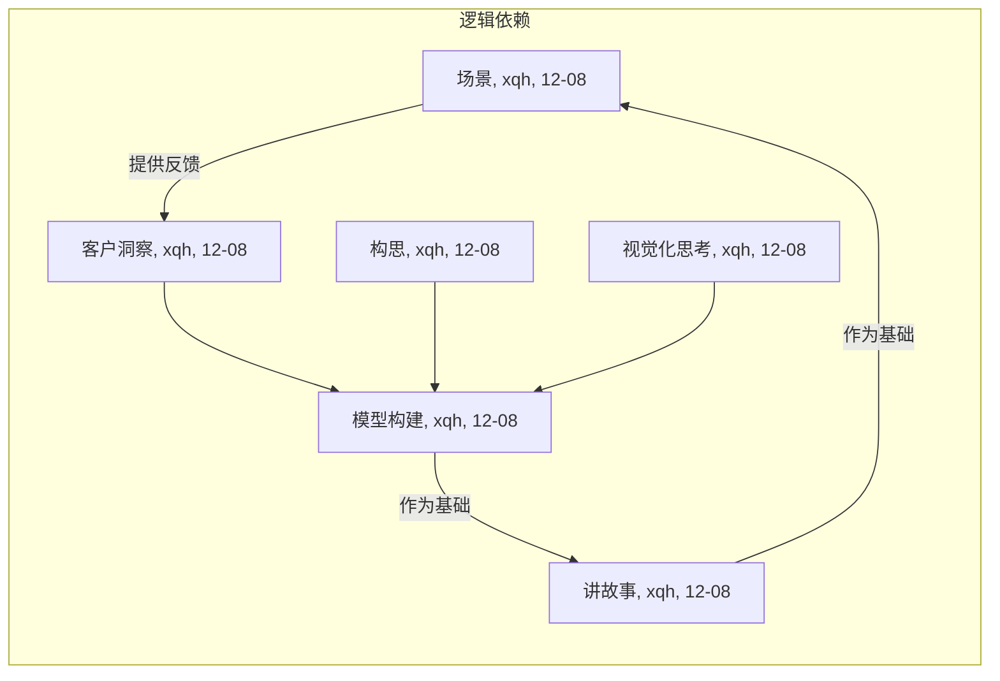

# Lab3-商业模式设计

[TOC]

## 商业模式设计简介

### 组员信息

| 姓名   | 学号      |
| :----- | :-------- |
| 熊丘桓 | 201250172 |
| 孙立帆 | 201250181 |
| 王福森 | 201250185 |
| 蔡之恒 | 201250127 |

### 工作概要<!-- ddl=12-08 -->

<!-- （1）本次作业构建的商业模式必须源于上一次作业，允许有 20% 以下的内容调整；（2）本次作业需要体现出细致的产品设计，不可泛泛而谈；（3）六个设计方法的产物在内容上要一致，六个章节之间需要通过文字描述进行逻辑上的起承转合； -->

### 度量数值<!-- ddl=12-08 -->

<!-- 客户洞察部分的移情图不得少于两个；构思部分的候选创意不得少于三个（不包含最终确定的创意）；模型构建部分更新的画布内总要点数量不少于 30 个，关联关系不少于 15 个；讲故事部分的故事数量不少于两个（至少一个公司视角故事，客户视角故事要源自两个移情图中的一个）；场景部分要点不少于 6 个（了解并评估、购买、获得、交互、售后、评价与可能的再次购买），并简要论述该场景的独特性（与其它竞品相比）。 -->

## 客户洞察<!-- ddl=12-08 -->

<!-- 客户洞察：【至少两个】典型客户群体的移情图（实践中一般为 3 到 5 个）与相关分析说明，需要包含客户针对产品的看、听、想与感受、说与做、痛点、收益六个部分； -->

<!-- 使用 Acrobat 对 pdf 进行编辑，再导出图片【而不是截图】 -->

<!-- 教材 P116-123 -->

### 日常网络交流者

日常网络交流者，即“大众网民”（待扩充）。

#### 统计特征

#### 移情图

### 宣传工作者

宣传工作者，包括记者、自媒体人、企业宣传工作者等（待扩充）。

#### 统计特征

#### 移情图

### 书面写作者

书面写作者，包括新闻工作者、秘书、出版社工作人员、文艺创作者等（待扩充）。

#### 统计特征

#### 移情图

## 构思<!-- ddl=12-08 --> 

<!-- 构思：【至少三个】候选商业模式创意（实践中一般为 5 到 8 个），以及最终确定的商业模式创意（筛选或整合得到），每个候选或确定的创意需包含驱动因素、“如果…会怎样”问题、以及创意对整个商业模式画布的影响； -->

<!-- 教材 P124-135 -->

### 创意一：

#### 驱动因素

#### What if 问题

#### 创意影响

### 创意二：

#### 驱动因素

#### What if 问题

#### 创意影响

### 创意三：

#### 驱动因素

#### What if 问题

#### 创意影响

### 创意四：<!-- czh -->

#### 驱动因素：客户驱动

#### What if 问题

如果我们为客户提供自动生成紧跟潮流、抽象的表达方式的工具（狗语生成器）怎么样？

可以从目标客户的移情图中得知，我们的一部分用户有在网络上表达自己观点的欲望，但是迫于“跟不上网络潮流”的担心（虽然我们认为这种担心是不太必要的），觉得自己朴实无华的文字没法吸引网友的注意。既然如此，我们为什么不利用相似的平台技术将用户正经的、书面的表达转化成抽象的、流行的网络表达，以满足这部分用户的心理需求和在网络上发声的欲望。

#### 创意影响

为此我们的价值主张将多一项：为用户提供网络流行语言翻译器（狗语生成器）；我们拟将狗语生成器免费开放，以此作为吸引用户使用平台的广告，期望对平台的核心功能（据意查图 / 典）起到引流的效果，因此这部分收益将不显式地计算在收入来源中；关键活动将多一项：狗语生成器的的 NLP 模型开发；成本结构将增加一项：开发狗语生成器的 NLP 模型费用。

## 视觉化思考<!-- ddl=12-08 -->

<!-- 视觉化思考：一张视觉化的商业模式画布（参考教材 147 页）与相关分析说明，画布应源于一同提交的【视觉化讲述商业模式的作业】 -->

<!-- 教材 P136-149 -->

### 视觉化的商业模式画布

### 分析说明

## 模型构建<!-- ddl=12-08 -->

<!-- 模型构建：更新过的商业模式画布与相关分析，需包含粗略的市场潜力预估、画布中各个模块之间的联系、以及支撑画布构建的基本事实（可引用上次作业的相关内容）；更新的画布内总要点数量不少于 30 个，关联关系不少于 15 个 -->

<!-- 教材 P150-159 -->

### 更新过的商业模式画布

### 市场潜力预估

### 模块联系

### 支撑画布构建的基本事实

## 讲故事<!-- ddl=12-08 -->

<!-- 讲故事：围绕【模型构建】中的【画布】编写至少一个源自大作业团队（公司）视角的故事，以及至少一个源自客户视角的故事，故事中需指明与画布中模块的对应关系； -->

<!-- 教材 P160-179 -->

### 团队视角

### 日常交流者 <!--czh: Dark Mode, TODO-->

**小之，20岁，南京大学软件工程专业本科生**

小之是一个好吃懒做的大三学生，胸无大志，上课摸鱼划水，下课游戏睡觉。在为数不多的清醒时间里，除去把老师布置的作业糊完，小之总是高强度“网上冲浪”。虽然小之“网上冲浪”的频率很高，但是网络潮流语言的更迭速度还是超过了他的接受能力。举个例子，有一天，小之和网友小兰聊天，面对小兰发来的 😭😅👋🏻👋🏻👋🏻 和 😆😭🤡 的表达，小之只觉得抽象程度太高，想要进行一些回应却心有余而力不足。除去跟网友聊天，小之还经常在知乎上闲逛，虽然小之的学历勉勉强强达到了知乎网友的平均水准，但是知乎里的逼王们各种高雅又上得了台面的表达方式让小之觉得自己就像一个文盲😭。在长时间的网上冲浪之后，小之常常感到空虚感和脱力感，而当他不情不愿关掉手机打开作业的时候，这种无力感又一次涌上心头。众所周知，南京大学软件学院的培养方案之先进和严格远远超出了小之的能力，除了写代码，小之还要完成大量的文档作业和 ppt 演讲汇报。几乎每次作业，经过长时间的思考，小之才能为自己的 ppt “磨”出了一段文案和配图；但小之盯着自己的作业，总感觉无法表达出自己的真心话，小之辗转反侧，痛苦不堪，感觉“失语症”愈发严重，最后却往往无法落笔修改，只能卡着 DDL 不情不愿地将作业上交。

今天，小之在网上冲浪的时候，发现了一个新兴的网络平台 —— Getit，这个平台提供了一个他之前从未见过（**价值主张 - 创新**）但令他心动无比的功能 —— 抽象转换器。恰好在这时，小兰又发来了 🤣🤡 的消息，面对小兰的挑衅，小之尝试使用 Getit 平台的抽象转换器功能。这个功能仅仅提供了一个搜索框，小之将 🤣🤡 输入之后，Getit 平台就自动（**客户关系 - 自动化服务**）生成了这一条抽象文本的意思（**价值主张 - 定制化，便利性，可获得性**）；理解了小兰的意思，小之将自己想要表达的观点输入了抽象转换器并启动了“反向翻译”功能，平台又自动为小之生成了 🤣👉🏻 的翻译。小之欣喜若狂，在和小兰的抽象大战中，他第一次感觉到自己取得了“胜利”。在网上冲浪的过程中取得了极大满足感的小之开心地打开了自己的作业，这一次作业，小之又要做 ppt 了。虽然小之感觉到自己已经有了一个还算不错的 idea ，但是表达仍然不是他的强项。做不出 ppt 的他又开始打开浏览器打发时间，这时他发现刚刚没有关闭的 Getit 平台的右上角居然还有一个“进入主站，据意查图 / 典”的按钮。其实小之自己是不太信任这种所谓的人工智能平台的，但是由于刚刚的“胜利”，小之对这个平台具有极大的好感，于是他决定再给它一次机会。主站仍然是只有寥寥几个简单的按钮。在据意查典功能中，小之输入了自己想要表达的内容之后，平台就自动为小之生成了相应的典故，而这就恰好是小之想要的，小之再一次欣喜若狂；而当他的 ppt 做到下一页发现需要找到一张合适的配图的时候，小之又想起了这个平台的“据意查图”的功能，但是这次，小之发现自己使用主站搜索引擎的试用次数已经满了，需要缴纳一笔不算特别贵但也不算特别便宜的使用费（**收入来源 - 使用费**）。虽然小之平时几乎不在这样的平台上花钱，但是联想到今天 Getit 平台给他在娱乐和作业上带来的酣畅淋漓之感，小之动了动手指付了一次使用费，果然，平台给他提供了一张精美而又符合要求的配图 —— Getit 又一次超出了他的预期。凭借着 Getit 平台，今天小之很快就完成了一份高质量的 ppt ，还提前好几天赶上了 DDL 。

后来，小之逐渐成为了 Getit 平台的常客，除了在知乎上闲逛，他也经常逛 Getit 平台的社区（**客户关系 - 社区**），他发现 Light Mode 的社区里面人人高雅而又和善，虽然大家的文化水平看上去都很高，但是表达方式都平易近人，并不像知乎一样容易给人带来焦虑，比如 Getit 的知名大 V 小熊，他就经常在 Getit 平台上分享自己的读书感悟和名句摘抄，有时甚至会分享自己刚作的诗词；而 Getit 社区的另一面 Dark Mode 则是自由跳脱，个性飞扬，比起百度贴吧这样的大“垃圾桶”少了许多戾气，更多是大家一起发发颠，聊聊天，好像走进了一个临时的“精神病院”，在这里面可以舒展精神、平息焦虑。在平台的深入使用中，小之很快就注册了会员（**收入来源 - 会员费**），这样不仅可以享受到平台更加优质的推荐算法，还可以减少长时间使用的成本。

作为软件工程专业的学生，小之自己也对 NLP 推荐算法有一定的了解，他知道，要实现这样的技术并不简单。有一天他惊奇地发现，这个平台的核心技术就是南大毕业的学长一手带队研发的，他还发现网络上各大图文素材版权库都与 Getit 有合作关系（**合作伙伴 - 素材资源版权方**）。背靠着这样优质的资源，再加上南京大学领衔的优质的团队，难怪 Getit 平台能够提供这么精准和优质的服务！与此同时，他还发现 Getit 平台很擅长与用户交流（**关键活动 - 跟进用户反馈**），吸纳用户提供的图文资源（**客户关系 - 与客户协作、共同创造**），比如小之见过的知名大 V 小熊，他就已经为这个平台提供了几百条高质量的诗文和经典摘要。而小之自己也想要参与一些平台贡献，但是无奈平台的审核机制非常严格，他提交的诗文由于质量不高被平台几次驳回（**关键业务 - 平台社区监管**）。贡献图文素材可能对于小之这样的理工科学生来说是有点难办了，但是他毕竟是软件工程专业的毕业生，于是他一改往日的颓势，选修了何老师的《大数据分析》和《机器学习》和李老师的《自然语言处理》，也希望毕业之后能够加入 Getit 的团队，和学长一起做一些既有技术力也有意义的事（**关键业务 - 搜索引擎推荐算法研发**）。

## 场景<!-- ddl=12-08 -->

<!-- 场景：针对【讲故事】中的【客户视角故事】设置客户与产品交互的场景，需体现出客户如何了解并评估产品、购买并获得产品、与产品交互、以及产品售后、客户对产品的评价与再次购买，建议突出场景与客户的连接（场景 IP+场景分发）；要点【不少于 6 个】（了解并评估、购买、获得、交互、售后、评价与可能的再次购买），并简要论述该场景的独特性（与其它竞品相比） -->

<!-- 教材 P170-185 -->