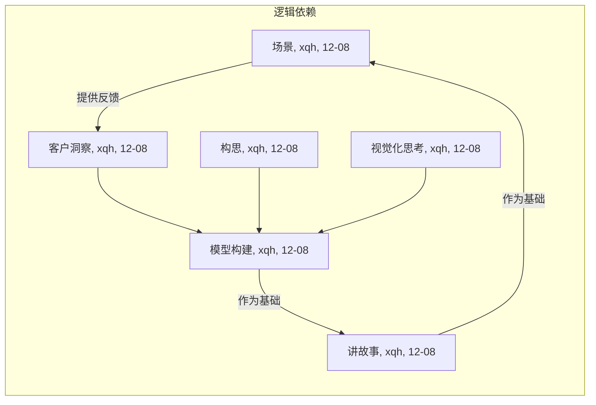

# Lab3-商业模式设计

[TOC]

## 商业模式设计简介

### 组员信息

| 姓名   | 学号      |
| :----- | :-------- |
| 熊丘桓 | 201250172 |
| 孙立帆 | 201250181 |
| 王福森 | 201250185 |
| 蔡之恒 | 201250127 |

### 工作概要<!-- ddl=12-08 -->

<!-- （1）本次作业构建的商业模式必须源于上一次作业，允许有 20% 以下的内容调整；（2）本次作业需要体现出细致的产品设计，不可泛泛而谈；（3）六个设计方法的产物在内容上要一致，六个章节之间需要通过文字描述进行逻辑上的起承转合； -->

### 度量数值<!-- ddl=12-08 -->

<!-- 客户洞察部分的移情图不得少于两个；构思部分的候选创意不得少于三个（不包含最终确定的创意）；模型构建部分更新的画布内总要点数量不少于 30 个，关联关系不少于 15 个；讲故事部分的故事数量不少于两个（至少一个公司视角故事，客户视角故事要源自两个移情图中的一个）；场景部分要点不少于 6 个（了解并评估、购买、获得、交互、售后、评价与可能的再次购买），并简要论述该场景的独特性（与其它竞品相比）。 -->

## 客户洞察<!-- ddl=12-08 -->

<!-- 客户洞察：【至少两个】典型客户群体的移情图（实践中一般为 3 到 5 个）与相关分析说明，需要包含客户针对产品的看、听、想与感受、说与做、痛点、收益六个部分； -->

<!-- 使用 Acrobat 对 pdf 进行编辑，再导出图片【而不是截图】 -->

<!-- 教材 P116-123 -->

### 日常网络交流者

日常网络交流者，即“大众网民”（待扩充）。

#### 统计特征

#### 移情图

### 宣传工作者

宣传工作者，包括记者、自媒体人、企业宣传工作者等（待扩充）。

#### 统计特征

#### 移情图

### 书面写作者

书面写作者，包括新闻工作者、秘书、出版社工作人员、文艺创作者等（待扩充）。

#### 统计特征

#### 移情图

## 构思<!-- ddl=12-08 --> 

<!-- 构思：【至少三个】候选商业模式创意（实践中一般为 5 到 8 个），以及最终确定的商业模式创意（筛选或整合得到），每个候选或确定的创意需包含驱动因素、“如果…会怎样”问题、以及创意对整个商业模式画布的影响； -->

<!-- 教材 P124-135 -->

### 创意一：

#### 驱动因素

#### What if 问题

#### 创意影响

### 创意二：

#### 驱动因素

#### What if 问题

#### 创意影响

### 创意三：

#### 驱动因素

#### What if 问题

#### 创意影响

### 创意四：<!-- czh -->

#### 驱动因素：客户驱动

#### What if 问题

如果我们为客户提供自动生成紧跟潮流、抽象的表达方式的工具（狗语生成器）怎么样？

可以从目标客户的移情图中得知，我们的一部分用户有在网络上表达自己观点的欲望，但是迫于“跟不上网络潮流”的担心（虽然我们认为这种担心是不太必要的），觉得自己朴实无华的文字没法吸引网友的注意。既然如此，我们为什么不利用相似的平台技术将用户正经的、书面的表达转化成抽象的、流行的网络表达，以满足这部分用户的心理需求和在网络上发声的欲望。

#### 创意影响

为此我们的价值主张将多一项：为用户提供网络流行语言翻译器（狗语生成器）；我们拟将狗语生成器免费开放，以此作为吸引用户使用平台的广告，期望对平台的核心功能（据意查图 / 典）起到引流的效果，因此这部分收益将不显式地计算在收入来源中；关键活动将多一项：狗语生成器的的 NLP 模型开发；成本结构将增加一项：开发狗语生成器的 NLP 模型费用。

## 视觉化思考<!-- ddl=12-08 -->

<!-- 视觉化思考：一张视觉化的商业模式画布（参考教材 147 页）与相关分析说明，画布应源于一同提交的【视觉化讲述商业模式的作业】 -->

<!-- 教材 P136-149 -->

### 视觉化的商业模式画布

### 分析说明

## 模型构建<!-- ddl=12-08 -->

<!-- 模型构建：更新过的商业模式画布与相关分析，需包含粗略的市场潜力预估、画布中各个模块之间的联系、以及支撑画布构建的基本事实（可引用上次作业的相关内容）；更新的画布内总要点数量不少于 30 个，关联关系不少于 15 个 -->

<!-- 教材 P150-159 -->

### 更新过的商业模式画布

### 市场潜力预估

### 模块联系

### 支撑画布构建的基本事实

## 讲故事<!-- ddl=12-08 -->

<!-- 讲故事：围绕【模型构建】中的【画布】编写至少一个源自大作业团队（公司）视角的故事，以及至少一个源自客户视角的故事，故事中需指明与画布中模块的对应关系； -->

<!-- 教材 P160-179 -->

### 团队视角

### 日常交流者 <!--czh: Dark Mode, TODO-->

## 场景<!-- ddl=12-08 -->

<!-- 场景：针对【讲故事】中的【客户视角故事】设置客户与产品交互的场景，需体现出客户如何了解并评估产品、购买并获得产品、与产品交互、以及产品售后、客户对产品的评价与再次购买，建议突出场景与客户的连接（场景 IP+场景分发）；要点【不少于 6 个】（了解并评估、购买、获得、交互、售后、评价与可能的再次购买），并简要论述该场景的独特性（与其它竞品相比） -->

<!-- 教材 P170-185 -->