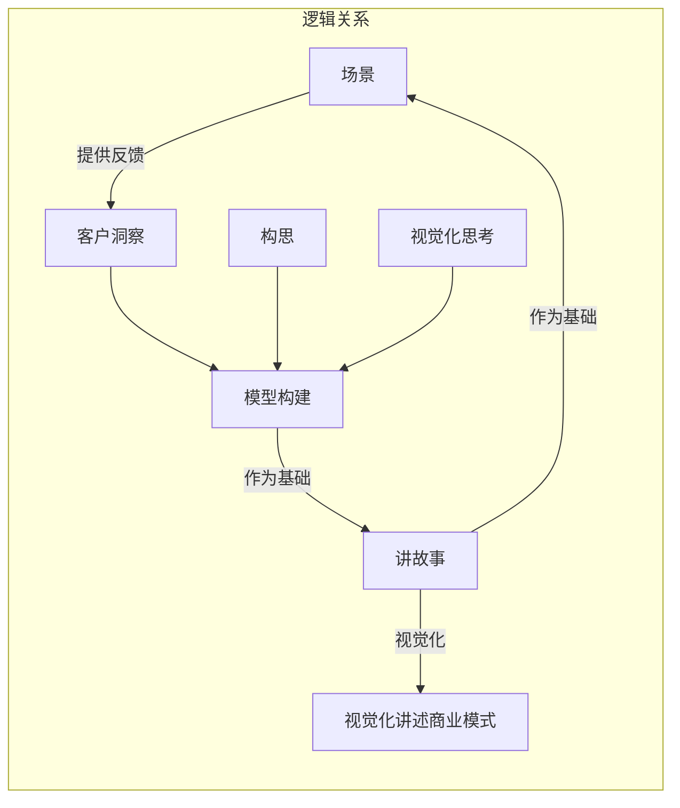
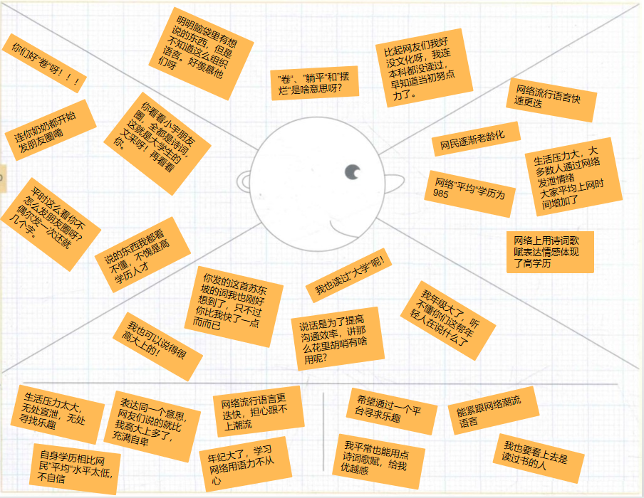
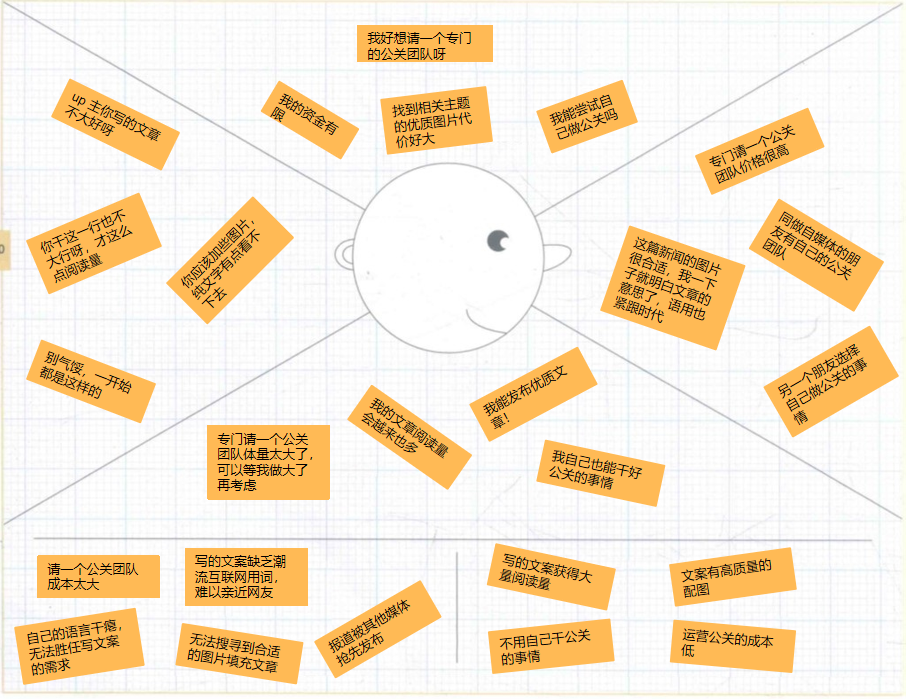
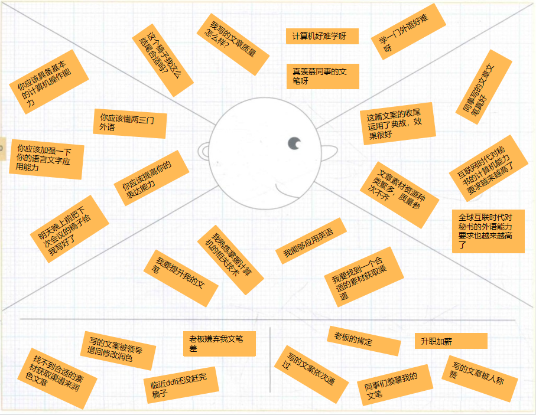

#  Lab3-商业模式设计

[TOC]

## 商业模式设计简介

### 组员信息

| 姓名   | 学号      |
| :----- | :-------- |
| 熊丘桓 | 201250172 |
| 孙立帆 | 201250181 |
| 王福森 | 201250185 |
| 蔡之恒 | 201250127 |

### 工作概要<!-- ddl=12-22 -->

<!-- （1）本次作业构建的商业模式必须源于上一次作业，允许有 20% 以下的内容调整；（2）本次作业需要体现出细致的产品设计，不可泛泛而谈；（3）六个设计方法的产物在内容上要一致，六个章节之间需要通过文字描述进行逻辑上的起承转合； -->

1. 本次作业构建的商业模式源于上一次作业，有 17.5% 的内容调整；
2. 视觉化讲述商业模式链接：<!-- TODO -->
3. 本次作业包括客户洞察、构思、视觉化思考、模型构建、讲故事、场景、视觉化讲述商业模式五个部分，五个部分之间的逻辑关系如下：

### 度量数值<!-- ddl=12-22 -->

<!-- 客户洞察部分的移情图不得少于两个；构思部分的候选创意不得少于三个（不包含最终确定的创意）；模型构建部分更新的画布内总要点数量不少于 30 个，关联关系不少于 15 个；讲故事部分的故事数量不少于两个（至少一个公司视角故事，客户视角故事要源自两个移情图中的一个）；场景部分要点不少于 6 个（了解并评估、购买、获得、交互、售后、评价与可能的再次购买），并简要论述该场景的独特性（与其它竞品相比）。 -->

本次作业的工作内容包括：

1. 客户洞察部分的移情图 3 个；
2. 构思部分的候选创意 6 个；
3. 模型构建部分更新的画布内总要点的数量 40 个，关联关系 17 个；
4. 讲故事部分的故事数量 4 个，其中 1 个公司视角的故事，3 个客户视角的故事；
5. 场景部分要点 16 个。

## 客户洞察<!-- ddl=12-22 -->

<!-- 客户洞察：【至少两个】典型客户群体的移情图（实践中一般为 3 到 5 个）与相关分析说明，需要包含客户针对产品的看、听、想与感受、说与做、痛点、收益六个部分； -->

<!-- 使用 Acrobat 对 pdf 进行编辑，再导出图片【而不是截图】 -->

<!-- 教材 P116-123 -->

### 日常网络交流者

日常网络交流者，即“大众网民”（待扩充）。

#### 统计特征

我国网民总规模 9.89 亿；收入上，月收入 8000 以上占 14.8%，过半收入超 3000；受教育程度，本科率 10% 左右，绝大多数网民的文化程度不高；职业上，学生、个体户和农民占比高；人口结构上，呈现老龄化趋势；上网时间上，平均每天近 4 小时。[^wfs-01]

#### 移情图

我国网民数量巨大，由于网络降低了人人互联成本，信息传递十分迅速，也导致互联网潮流语言必将是快速更迭，小宏平时忙于工作，偶尔翻阅朋友圈和知乎，每过一段时间就会冒出一些看不懂的词，每次都得查搜索引擎和各大网站来紧跟潮流，感觉需要花费较大力气跟上互联网。同时互联网说谎话没代价，很多人自称高学历，是不是 copy 一首诗词歌赋发到朋友圈，显得自己有文人风骨，小宏就经常看到小宇在朋友圈发一些自己看不懂的诗词，还总是听到自己妈妈夸小宇，感觉很不是滋味。虽然自己可以也 copy 一篇发到朋友圈，但是怕自己朋友倒时候问自己自己答不上来。小宏毕业后很少写文章，平时说话也少，上网时间也越来越多，导致”失语症“愈发严重。Get-It 平台可以很好的解决小宏的问题，不用花很大力气就能了解最新网络用语、输入意思即可获得相关诗词歌赋、输入模糊意思即可得到文笔优美的句子等等。

### 宣传工作者

宣传工作者，包括自媒体人、企业宣传工作者等（待扩充）。

#### 统计特征

我国自媒体人生产内容以图文为主，约占 80%，从业人数超 260 万，从业人员主要为 30 岁以下的年轻人，超 8 成自媒体人学历为专科和本科，学历较高，但从事自媒体行业年限较短，超 8 成低于两年。

#### 移情图

Get-It
平台可以根据输入的模糊意向得到相应的文章或句子，自媒体从业者可以从这些文章中学习语用，并且部分摘抄到自己的文章中，以此来润色文章。自媒体从业者还可以在平台上搜索相关的网络流行语言，理解其意思并且运用到文章中，使得文章更加接地气。自媒体从业者还能从平台上获得相关内容的大量优质图片，不必在苦于花费大量时间在浩如烟海的互联网中搜寻。

### 书面写作者

书面写作者，包括新闻工作者、秘书、出版社工作人员、文艺创作者等（待扩充）。

#### 统计特征

我国秘书行业从业人员已经超过 2000 万，但是 80% 以上的秘书没有受过专门培训。职场上的秘书分为三个层级，普通秘书收入为 2000-4000 元，总经理秘书约 5000 元，而外企公司总裁办公室高级秘书的月薪大约在 8000 元到 1
万元之间。[^wfs-02]

#### 移情图

目前书面工作者普遍没有接受过专门的培训，文笔功底有待提升，素材收集能力也有发展空间。Get-It 平台可以陪伴书面工作者度过最艰难的入门时刻，这个阶段书面工作者苦于提升文笔，润色特定主题的文章，为文稿搜集素材，Get-It
平台正好可以为他们提供相关主题的文章来学习或引用，提高高质量图文和诗文来润色文章，帮助他们获得领导的青睐。

## 构思<!-- ddl=12-08 -->

<!-- 构思：【至少三个】候选商业模式创意（实践中一般为 5 到 8 个），以及最终确定的商业模式创意（筛选或整合得到），每个候选或确定的创意需包含驱动因素、“如果…会怎样”问题、以及创意对整个商业模式画布的影响； -->

<!-- 教材 P124-135 -->

<!-- TODO：增加到 6 个候选商业模式创意，并筛选整合得出最终发的商业模式创意 -->

### 创意一

#### 驱动因素

财务驱动，创新来源于对成本结构的缩减。

#### What if 问题

如果我们不自己持有素材资源，而是和版权方对接，向用户提供指向版权方资源的入口，即链接，会怎样?

#### 创意影响

如果需要自己持有素材资源的话，由于用户的需求是十分多样化的，我们并没有办法准确的知道持有哪些版权素材资源是最合理的，因此为了给用户良好的体验，我们需要向版权方支付大量的版权费，使得我们的成本结构变得过于重量级，削弱了我们的抗风险能力；而直接与版权方合作并通过为其资源引流的方式来为用户提供服务虽然一定程度上减少了我们的单次服务利润，但是总体上看使得我们可以提供更大量的服务，且使我们的成本结构更加健康，抗风险能力更强。

### 创意二

#### 驱动因素

供给驱动，我们的产品创造了新的价值主张：据意查图 / 文，而不是据图 / 文查意。

#### What if 问题

如果我们提供据意查图 / 文，而不是据图 / 文查意的服务会怎样？

#### 创意影响

结合调研和小组成员的切身体验，互联网世代 “失语症”是一个广泛存在的问题，但是目前尚无一个成熟的商业产品针对这一需求。借助近年来深度学习技术的发展，我们通过多模态的反向查询来满足用户的这一广泛存在但是尚未被很好的满足的需求，这是我们提出的新的价值主张。

由于这一价值主张的落地依赖于前沿的技术，因而影响了我们的商业模式的关键业务（算法研发）和核心资源（知识性资源，人力资源）；而我们的价值主张针对的需求的性质则影响了我们的商业模式的客户关系（由于内容性的资源是与时俱进的，需要用户的参与，因此维护一个社区是重要的）和客户细分（主要针对日常有表达需要的群体）。

### 创意三

#### 驱动因素

客户驱动

#### What if 问题

如果我们为用户提供自动润色文章的工具会怎么样？

#### 创意影响

可以从目标客户的移情图分析中得知，我们的用户使用 Get-It 平台除了愿意借用这个社区分享高质量图文外，还有一部分需求是对自己写的文章中的部分语句进行替换，换成高质量图文，以此达到润色文章的目的。既然如此我们为何不可直接为用户提供自动润色文章的工具，这将省去用户很大一部分精力，为用户提供更加遍历的平台，提高用户对自身需求满足的可获得性。

对此我们的价值主张将多一项：为用户提供自动润色文章的功能；客户关系的自动化服务程度将大大提升；收入来源将增加一项：自动润色文章使用费；关键活动将多一项：自动润色文章的 NLP 模型开发；成本结构将增加一项：开发自动润色文章的 NLP
模型费用。

### 创意四<!-- czh -->

#### 驱动因素：客户驱动

#### What if 问题

如果我们为客户提供自动生成紧跟潮流、抽象的表达方式的工具（火星语生成器）怎么样？

可以从目标客户的移情图中得知，我们的一部分用户有在网络上表达自己观点的欲望，但是迫于“跟不上网络潮流”的担心（虽然我们认为这种担心是不太必要的），觉得自己朴实无华的文字没法吸引网友的注意。既然如此，我们为什么不利用相似的平台技术将用户正经的、书面的表达转化成抽象的、流行的网络表达，以满足这部分用户的心理需求和在网络上发声的欲望。

#### 创意影响

为此我们的价值主张将多一项：为用户提供网络流行语言翻译器（火星语生成器）；我们拟将火星语生成器免费开放，以此作为吸引用户使用平台的广告，期望对平台的核心功能（据意查图 / 典）起到引流的效果，因此这部分收益将不显式地计算在收入来源中；关键活动将多一项：火星语生成器的的 NLP 模型开发；成本结构将增加一项：开发火星语生成器的 NLP 模型费用。

### 创意五<!-- xqh ddl=12-05 -->

#### 驱动因素

客户驱动

#### What if 问题

如果我们将用户群体扩展到学生群体会怎么样？

#### 创意影响

许多学生面临着繁重的学术任务，包括课堂展示、文献综述写作和实验报告写作等等，相比于精准表达，学术实践本身才是学习的核心。为了帮助学生平稳过渡开始学术实践的表达阶段，以更好的将精力集中到学术实践和学术思想本身，我们尝试提供能够满足学生使用要求的产品服务，例如规范成熟的学术表达范例、学术展示模板等。学生群体尝试新产品的意愿强烈，该产品服务在学生群体中更容易得到推广并受到青睐。

该创意模式将在商业模式画布的“客户细分”中增加“学生群体”要素。

### 创意六<!-- xqh ddl=12-05 -->

#### 驱动因素

资源驱动

#### What if 问题

如果我们把搜索引擎等软件资源出租会怎样？

#### 创意影响

搜索引擎是我们软件产品服务必要的资源，如果将其出租以为其他企业提供搜索服务，并不会增加产品的运营成本，且可以扩大产品服务的收益途径。

该创意模式将在商业模式画布的“收入来源”中增加“工具使用费”要素。

### 最终商业模式创意

保留创意三、创意四、创意五。

创意三：价值主张将增加一项：为用户提供自动润色文章的功能；客户关系的自动化服务程度将大大提升；收入来源将增加一项：自动润色文章使用费；关键活动将多一项：自动润色文章的 NLP 模型开发；成本结构将增加一项：开发自动润色文章的 NLP 模型费用。

创意四：价值主张将增加一项：为用户提供网络流行语言翻译器（火星语生成器）；我们拟将火星语生成器免费开放，以此作为吸引用户使用平台的广告，期望对平台的核心功能（据意查图 / 典）起到引流的效果，因此这部分收益将不显式地计算在收入来源中；关键活动将多一项：火星语生成器的的 NLP 模型开发；成本结构将增加一项：开发火星语生成器的 NLP 模型费用。

创意五：该创意模式将在商业模式画布的“客户细分”中增加“学生群体”要素。

## 视觉化思考<!-- xqh ddl=12-03 -->

<!-- 视觉化思考：一张视觉化的商业模式画布（参考教材 147 页）与相关分析说明，画布应源于一同提交的【视觉化讲述商业模式的作业】 -->

<!-- 教材 P136-149 -->

<!-- Lecture-13 Page 9 -->

### 视觉化的商业模式画布

### 分析说明

相比于上一次作业，本次的商业模式画布增加了“学生”这一群体作为用户细分的重要部分。其他画布元素的分析说明参见第一次作业 [3.2 要点介绍](#要点介绍)

## 模型构建<!-- ddl=12-03 -->

<!-- 模型构建：更新过的商业模式画布与相关分析，需包含粗略的市场潜力预估、画布中各个模块之间的联系、以及支撑画布构建的基本事实（可引用上次作业的相关内容）；更新的画布内总要点数量不少于 30 个，关联关系不少于 15 个 -->

<!-- 教材 P150-159 -->

### 更新过的商业模式画布

### 市场潜力预估

新的商业模式画布在旧画布的基础上进行了不超过 30% 的修改，借用商业模式评估和蓝海战略等分析探究手段，力争从设计上减少成本并提高收益，增加商业模式的稳定性和灵活性，降低了商业模式的经营负担。

### 模块联系

1. 经过上次作业蓝海战略的探究，我们选择新加入“**社交媒体**”作为关键合作的一部分，加入“**工具使用费**”作为收入来源的一部分。并删除原画布中的收入来源要点“**广告费**”。
2. 我们尝试开展与社交媒体的深度合作，这有利于捕捉流行于社交媒体的网络表达素材内容。因此，我们在重要合作中添加了社交媒体部分，以期助推 Dark Mode 网络流行工具集开发。
3. 我们在以上的工作中分析认为，软件平台开发和搜索引擎推荐算法研发在我们的产品项目中占据重要地位，作为我们的核心知识产权，这些工具可以作为产品的一部分，出租或销售给其他有需要的企业或单位使用，收入工具使用费，增加收入来源。
4. 根据网络广告市场的调研报告[^xqh-17]，中小互联网企业的流量入口很难吸引广告费作为成规模的收入，因此我们在修改商业模式时不再将广告费作为主要的收入来源。
5. 我们在上次作业的 [3.2.1.1 基础设施优势/劣势评估](#基础设施优势/劣势评估)分析得出，我们如果扩展并加深与素材资源版权方的联系，有利于软件平台开发、维护和升级的顺利进行；依托版权方提供的大量资源，我们可以顺利度过高质量图文原始积累的“冷启动”时期，并在启动时期过后持续帮助资源内容进行迭代。该合作的顺利进行，将进一步丰富我们的知识性资源和素材资源。

其他模块联系参见第一次作业的 [4. 要点关联](#要点关联)。

### 支撑画布构建的基本事实

支撑画布构建的基本事实参见第二次作业的 [2. 商业模式环境]()。

## 讲故事<!-- ddl=12-08 -->

<!-- 讲故事：围绕【模型构建】中的【画布】编写至少一个源自大作业团队（公司）视角的故事，以及至少一个源自客户视角的故事，故事中需指明与画布中模块的对应关系； -->

<!-- 教材 P160-179 -->

<!-- demo：教材 P166-167 -->

### 团队视角<!-- xqh ddl=12-07 -->

**Eagle Bear 20 岁，南京大学软件学院本科生。**

Eagle Bear 是南京大学软件学院的本科生和 Get-It 平台的创始人之一。在匡老师的精心指导下，Eagle 抱着三个队友的大腿顺利完成了平台的初期开发运维工作。

随着平台上线和原始用户的积累，Eagle 发现用户对平台的期待越来越高，从平台上线到现在已经有半年的时间，初期积累的图文资源部分（**关键业务-高质量图文原始积累与迭代更新**）已经不再流行而被互联网遗忘，另一部分资源则随着流行而普及，不再具有前卫色彩；即使是来源广泛（**重要合作-素材资源版权方**）的经典的图文素材（**核心资源-知识性资源，核心资源-素材资源**），也因数目有限而难以满足日益丰富的用户市场。Eagle 和他的团队难以及时捕捉到瞬息万变的网络新生表达进行捕捉，更难以组织整理浩如烟海而各具特色的经典个性化表达。在商业模式评估作业会议上，Eagle 艰难地提出：客户参与创造！

团队的其他成员对这一主张交换了意见，大家一致认为，丰富社区内容（**客户关系-与客户协作、共同创造，核心资源-社区资源**），扩大素材来源，是提高产品竞争力、不断满足客户现有需求、发掘客户潜在需求的绝佳方式。在新的商业模式设计中，Eagle 和他的团队把社交媒体（**重要合作-社交媒体**）作为新的重要合作元素，并期望整合社交媒体和社区（**客户关系-社区**）模块，让更多的用户积极的参与到新的素材创作当中来。

团队成员作为纯技术性的人才，大家擅长的工作领域高度重合：软件开发运维（**关键活动-软件平台的开发、维护和升级，关键活动-搜索引擎推荐算法研发，关键活动-Dark Mode 网络流行工具集开发，关键活动-自动润色文章的 NLP 模型开发**）只覆盖了商业模式关键活动的一部分。团队希望在接下来的学习中，通过外包等形式（**核心资源-人力资源**）完成平台社区监管、跟进用户反馈等业务（**关键业务-平台社区监管，关键业务-跟进用户反馈**
）。在李传艺老师的建议下，我们团队选择与云服务公司（**关键合作-云服务公司**）进行深度合作，以减少软件运维的硬件成本和管理成本（**成本结构-固定成本，成本结构-可变成本**）。

产品上线数周后，Eagle 观察到社区当中有越来越多的用户积极分享自己的 meme、表情包和优质的文字素材，这反过来增强了产品服务的用户粘性；借助合作的主流社交媒体，网络新生表达更容易得到捕捉和整理。

### 宣传工作者视角<!-- wfs ddl=12-05 -->

**小铁，24岁，大专毕业后的自媒体人**

“2 年了，我干自媒体行业已经 2 年了，不能说很失败，但是不如意呀......”，小铁站在公园小道上，回想着自己过去两年在自媒体行业摸爬滚打的经历。大专期间小铁就开始在 b 站上联合同学小磊一起分享自己的大专生活、锐评知乎各大帖等积累经验，也有不多但稳定的观看量，凭着这份激情，以及看到头部自媒体人客观的收入，毕业后小铁和小磊都不顾家里的反对毅然决然走上自媒体的道路（**客户细分-宣传工作者**）。

两年间，虽然阅读量依旧稳定且有所增长，但他这远不是当初自己预想的样子。小铁对自己的事业投入很多精力，但他逐渐意识到自己干瘪的文字和拿不上台面的语言功底是自己很大的瓶颈，究其本源是自己的文化功底太差了，这是硬伤呀，愈发觉得对不起初高中语文老师的教导。小铁没有一蹶不振，仍然努力工作。某天在搜集图片素材的时候，在图片素材网站上看到的对 Get-It 平台的广告（**关键伙伴-素材资源版权方**），由于该图片素材网站提供的图片和他想要的主题差得十万八千里，且 Get-It 平台宣称能为其提供用户想要的高质量图片（**价值主张-可获得性**），而其当时苦于搜寻对应主题的图片来写文案，急躁不安的小铁就点开广告跳转到了 Get-It 平台，撇到了平台还提供据意查文/典故/图等功能，但小铁眼中只有自己想要的图片，就在搜索框中输入了图片的主题，回车以后得到了几张图片（**客户关系-自动化服务**），小铁看上去感觉还过得去，和自己的主题还挺切合的就免费下载了。

突然有一天，小铁看到小磊的粉丝数量激增，不解的小铁点开了小磊发布的文章和视频，发现阅读量都有显著的提升，粉丝们的评论也都是夸赞小磊妙笔生花。小铁心想，小磊这小兔崽子我还不知道，他文笔功底也没比我好多少，前几天吃饭跟他聊天可没听出他说话提高了啥。带着疑惑和不解，小铁找到小磊，小磊就给小铁道明原委。“不知道你听没听过Get-It 平台呀？这个平台不仅图片素材资源丰富，搜出来的图片跟输入的主题相关度极高嘞。还有还有，我把我那比你还丑的话输入进去，就会得到一个我自己看了都惊叹的句子嘞。里面还有社区，有好多社友在分享如何让自己的写作更加打动人呢！”（**客户关系-与客户协作、共同创造**）小铁一回想，这不正是之前自己看到的广告嘛，于是便开始静下心来探索 Get-It 平台。（**渠道通路-认知**）小铁发现这个据意查文/典故/图的功能是真的强大，不仅让小铁见识到了文字还能这么创造（**价值主张-创新**），更重要的是平台给小铁推荐的文章和句子让小铁不禁说出 “就是这个！”。小铁对自己职业未来又充满了希望。经过小铁一段时间的探索，他越来越依赖 Get-It 平台了，他不需要很多的图片素材网站了，不需要网上质量层次不齐的提升语言功底的博客了，这些功能 Get-It 平台都能为他提供。小铁可以通过平台高效的搜索引擎为自己的文章和视频搜寻高质量的图片素材（**价值主张-缩减成本**），还可以通过平台的”自动润色文章“功能方便的改善粉丝阅读自己文章的体验（**价值主张-便利性/实用性**），而且还可以在平台的社区中得到改善自己文学功底的真正建议，同时分享自己的学习体验（**客户关系-社区**）。为了能使用更多的功能，小铁毫无疑问成为了平台的会员（**收入来源-会员费**，**渠道通路-购买**），这将为小铁额外带来一周 3 次免费使用 “自动润色文章”工具等权益，当然，小铁有时候也会偷懒，导致他每周不得不额外付费使用“自动润色文章”工具（**收入来源-使用费**）。小铁偶尔会在 Get-It 平台上看到其他平台的广告（**收入来源-广告费**），但是总体上偏少。广告的布局有时候不太合理，小铁积极提供建议，很快就得到了 Get-It 的反馈（**客户关系-与客户协作、共同创造**），同时 Get-It 平台给小铁额外一个月的会员作为感谢。自从小铁使用 Get-It 平台后，小铁的粉丝和文章阅读量有了质的变化，小铁在自己家人面前也越来越抬得起头了。小铁还从平台社区中认识了很多和自己有相同问题、都需要提升文笔的社友，大家一起学习，一起避坑，一起成长，向着美好未来一起前行。

### 书面写作者视角<!-- slf ddl=12-05 -->

**小宇，23 岁，初入职场的文秘**

小宇是去年刚从南京大学毕业的本科生，在毕业季的招聘中拿到了某企业的中级秘书的 offer(**客户细分-书面写作者**)。在如此不景气的就业环境中拿到了 offer，小宇感到很开心。但是入职后不久，这份工作就让他感到头大。作为一名中级秘书，小宇的日常主要包括一些文字相关的工作，比如起草文件、办理公文、调查研究和整理信息等。但是作为一个理工科的毕业生，小宇的文字功底并不是很好，能通过面试成功上岸全靠小宇在招聘季来临之前进行了一次史无前例的突击。然而上岗之后面对真实的工作场景，小宇就无法掩盖他的真实水平了。

入职之后，由于小宇是南京大学的毕业生，领导对他寄予了厚望，给他分配了一些比较重要的公文写作和调查研究工作。初入职场就面对这样的任务，小宇感到压力山大，对着自己的文字删删改改，却终究还是感觉差了些什么。小宇也请教过同部门的一些前辈，他们大多是文科相关专业出身，又有若干年的工作经验，文字功底和小宇自然不在一个量级，但是文字功底毕竟是需要积累的能力，短时间内也无法得到什么好的建议，看着自己与同事的能力差距，小宇的焦虑又增加了一分。

面对 DDL 一天天迫近，小宇感觉到深深的无力，他打开手机准备刷刷 b 站放松一下，首页推荐的一个视频吸引了他的注意 (**渠道通路-和一些 up 主合作推广**)。 视频中介绍了 Get-It 平台能够辅助文字工作者的创作工作的功能（**价值主张-缩减成本**），比如据意查句，据意查词等，并且大部分基础功能都是免费的，部分进阶功能才会收取费用（**收入来源-免费的基础功能 + 会员费**）。小宇抱着不妨试试的态度打开了 Get-It 平台的网站，体验了平台的据意查句 / 词和图片素材搜索功能。小宇在这些功能的辅助下试着对自己的公文以及调研报告进行修改润色，经过一番修改之后，小宇开始有点感觉了。在 Get-It 平台的帮助下，小宇在 DDL 之前终于交上了一份至少让自己满意的公文和调研报告，并因此受到了领导的认可。小宇感觉自己的工作受到了认可，对未来的工作也逐渐有了信心。

这之后，小宇成为了 Get-It 平台的忠实用户，他发现 Get-It 平台不仅拥有能够辅助文字工作者工作的强大功能，还有一个活跃的社区 (**客户关系-社区，与用户共同创造**)，在平台的 Light Mode 社区中也有许多像他一样的文字工作者分享一些自己的内容，小宇通过阅读他人分享的内容，或者和其他用户交流探讨，也逐渐开始积累自己的文字应用能力。

一年多来，Get-It 平台帮助小宇成功度过了最艰难的入门时期，小宇从一名非科班的毕业生，成长为优秀的文秘，凭借他高质量的工作，在今年成功升了职。小宇现在也在 Get-It 平台上分享一些自己的内容和经验，希望借此帮助更多像当初的他一样的入门文字工作者平滑地度过最困难的入门期 (**客户关系-社区，和用户共同创造**)，在平台上收获他人的肯定也让他获得了成就感。

### 日常交流者 <!-- czh: Dark Mode, TODO -->

**小之，20岁，南京大学软件工程专业本科生**

小之是一个好吃懒做的大三学生，胸无大志，上课摸鱼划水，下课游戏睡觉。在为数不多的清醒时间里，除去把老师布置的作业糊完，小之总是高强度“网上冲浪”。虽然小之“网上冲浪”的频率很高，但是网络潮流语言的更迭速度还是超过了他的接受能力。举个例子，有一天，小之和网友小兰聊天，面对小兰发来的 😭😅👋🏻👋🏻👋🏻 和 😆😭🤡 的表达，小之只觉得抽象程度太高，想要进行一些回应却心有余而力不足。除去跟网友聊天，小之还经常在知乎上闲逛，虽然小之的学历勉勉强强达到了知乎网友的平均水准，但是知乎里的逼王们各种高雅又上得了台面的表达方式让小之觉得自己就像一个文盲😭。在长时间的网上冲浪之后，小之常常感到空虚感和脱力感，而当他不情不愿关掉手机打开作业的时候，这种无力感又一次涌上心头。众所周知，南京大学软件学院的培养方案之先进和严格远远超出了小之的能力，除了写代码，小之还要完成大量的文档作业和 ppt 演讲汇报。几乎每次作业，经过长时间的思考，小之才能为自己的 ppt “磨”出了一段文案和配图；但小之盯着自己的作业，总感觉无法表达出自己的真心话，小之辗转反侧，痛苦不堪，感觉“失语症”愈发严重，最后却往往无法落笔修改，只能卡着 DDL 不情不愿地将作业上交。

今天，小之在网上冲浪的时候，发现了一个新兴的网络平台 —— Get-It，这个平台提供了一个他之前从未见过（**价值主张-创新**）但令他心动无比的功能 —— 抽象转换器。恰好在这时，小兰又发来了 🤣🤡 的消息，面对小兰的挑衅，小之尝试使用 Get-It 平台的抽象转换器功能。这个功能仅仅提供了一个搜索框，小之将 🤣🤡 输入之后，Get-It 平台就自动（**客户关系-自动化服务**）生成了这一条抽象文本的意思（**价值主张-定制化，便利性，可获得性**）；理解了小兰的意思，小之将自己想要表达的观点输入了抽象转换器并启动了“反向翻译”功能，平台又自动为小之生成了 🤣👉🏻 的翻译。小之欣喜若狂，在和小兰的抽象大战中，他第一次感觉到自己取得了“胜利”。在网上冲浪的过程中取得了极大满足感的小之开心地打开了自己-的作业，这一次作业，小之又要做 ppt 了。虽然小之感觉到自己已经有了一个还算不错的 idea，但是表达仍然不是他的强项。做不出 ppt 的他又开始打开浏览器打发时间，这时他发现刚刚没有关闭的 Get-It 平台的右上角居然还有一个“进入主站，据意查图 / 典”的按钮。其实小之自己是不太信任这种所谓的人工智能平台的，但是由于刚刚的“胜利”，小之对这个平台具有极大的好感，于是他决定再给它一次机会。主站仍然是只有寥寥几个简单的按钮。在据意查典功能中，小之输入了自己想要表达的内容之后，平台就自动为小之生成了相应的典故，而这就恰好是小之想要的，小之再一次欣喜若狂；而当他的
ppt 做到下一页发现需要找到一张合适的配图的时候，小之又想起了这个平台的“据意查图”的功能，但是这次，小之发现自己使用主站搜索引擎的试用次数已经满了，需要缴纳一笔不算特别贵但也不算特别便宜的使用费（**收入来源-使用费**）。虽然小之平时几乎不在这样的平台上花钱，但是联想到今天 Get-It 平台给他在娱乐和作业上带来的酣畅淋漓之感，小之动了动手指付了一次使用费，果然，平台给他提供了一张精美而又符合要求的配图——Get-It  又一次超出了他的预期。凭借着 Get-It 平台，今天小之很快就完成了一份高质量的 ppt ，还提前好几天赶上了 DDL 。

后来，小之逐渐成为了 Get-It 平台的常客，除了在知乎上闲逛，他也经常逛 Get-It 平台的社区（**客户关系-社区**），他发现 Light Mode
的社区里面人人高雅而又和善，虽然大家的文化水平看上去都很高，但是表达方式都平易近人，并不像知乎一样容易给人带来焦虑，比如 Get-It 的知名大 V 小熊，他就经常在 Get-It 平台上分享自己的读书感悟和名句摘抄，有时甚至会分享自己刚作的诗词；而 Get-It 社区的另一面 Dark Mode 则是自由跳脱，个性飞扬，比起百度贴吧这样的大“垃圾桶”少了许多戾气，更多是大家一起发发颠，聊聊天，好像走进了一个临时的“精神病院”，在这里面可以舒展精神、平息焦虑。在平台的深入使用中，小之很快就注册了会员（**收入来源-会员费**），这样不仅可以享受到平台更加优质的推荐算法，还可以减少长时间使用的成本。

作为软件工程专业的学生，小之自己也对 NLP 推荐算法有一定的了解，他知道，要实现这样的技术并不简单。有一天他惊奇地发现，这个平台的核心技术就是南大毕业的学长一手带队研发的，他还发现网络上各大图文素材版权库都与 Get-It 有合作关系（**合作伙伴-素材资源版权方**）。背靠着这样优质的资源，再加上南京大学领衔的优质的团队，难怪 Get-It 平台能够提供这么精准和优质的服务！与此同时，他还发现 Get-It 平台很擅长与用户交流（**关键活动-跟进用户反馈**），吸纳用户提供的图文资源（**客户关系-与客户协作、共同创造**），比如小之见过的知名大 V 小熊，他就已经为这个平台提供了几百条高质量的诗文和经典摘要。而小之自己也想要参与一些平台贡献，但是无奈平台的审核机制非常严格，他提交的诗文由于质量不高被平台几次驳回（**关键业务-平台社区监管**）。贡献图文素材可能对于小之这样的理工科学生来说是有点难办了，但是他毕竟是软件工程专业的毕业生，于是他一改往日的颓势，选修了何老师的《大数据分析》和《机器学习》和李老师的《自然语言处理》，也希望毕业之后能够加入 Get-It 的团队，和学长一起做一些既有技术力也有意义的事（**关键业务-搜索引擎推荐算法研发**）。

## 场景<!-- czh slf wfs ddl=12-08 -->

<!-- 场景：针对【讲故事】中的【客户视角故事】设置客户与产品交互的场景，需体现出客户如何了解并评估产品、购买并获得产品、与产品交互、以及产品售后、客户对产品的评价与再次购买，建议突出场景与客户的连接（场景 IP+场景分发）；要点【不少于 6 个】（了解并评估、购买、获得、交互、售后、评价与可能的再次购买），并简要论述该场景的独特性（与其它竞品相比） -->

<!-- 教材 P170-185 -->

### 小铁（宣传工作者）

小铁无意间看到自己熟悉的同行小磊的文章质量和粉丝数量突然有了很大的提升，但根据自己与小磊最近的接触以及对其的了解，小铁认为小磊的文笔实力并没有明显提升。带着疑惑小铁从小磊那里得知的了他的秘密武器 “Get-It 平台”，并且通过一小段时间的探索，他深深地爱上了这个平台（**了解与评估**）。前期良好的体验让小铁十分满意甚至有点喜出望外，为了使用更加丰富的功能，小铁不仅多次付费购买“自动润色文章”工具，而且充值成为平台会员（**购买**），在享受免费的平台高效搜索引擎为自己的文章和视频搜寻高质量的图片素材外，小铁还能在平台社区汲取各个社友分享的提升文学素养的经验（**获得**）。与此同时，小铁也积极在社区上分享自己的学习方法，看到有越来越多的人为自己这个“指路人”点赞，小铁感到一丝满足（**交互**）。对于平台不合理的广告布局，小铁也积极向平台反馈，平台积极整改的同时也为小铁送上一个月的会员作为鼓励（**售后**）。自从小铁使用 Get-It 平台后，小铁的粉丝量和文章点赞数量都有了质的提升，小铁也越来越离不开 Get-It 平台了。小铁离不开的不仅仅是平台为会员提供的强大功能，还有家人一般的、共同进步的社友们（**评价与可能的再次购买**）。

#### 独特性

可能会有很多平台为用户提供文章措辞优化的服务（比如竞品 WantWords），可能会有一个论坛专门讨论如何提升文学素养、如何写出更加优美动人的句子，但 Get-It 平台不仅能提供前者所提供的服务，弥补宣传工作中文学功底不足的短板，还能建立一个庞大的社区。这个社区不只是讨论如何提升文学素养的平台，更有一群同是从事自媒体行业的社友分享自己进步的点点滴滴，这种同行业层面的共情让用户对社区产生了极强的粘性。不同行业的宣传工作者都能在这里看到“同事们”的状态，他们就像“明天的自己”，激励着自己在行业上越走越远。

### 小之（日常交流者）

小之在日常使用的过程中发现了 Get-It 平台，并被其 Dark Mode
中提供的抽象翻译器功能所吸引，试用之后觉得“有趣”，而且它切实解决了小之虽有些畸形但确实存在的需求，这一部分功能的免费开放提高了他对于平台的好感度；而当他需要网站上提供的真正的服务的时候，会有兴趣进行试用（**了解与评估**）。但真正促使他付费的是平台所能提供的优质内容和服务，这样在试用次数满了之后他会选择付费（**购买**）。付费后，小之轻易地从网络上下载了他所需要的图文资源（**获得**）。在一次好的使用体验之后，小之开始关注 Get-It 平台的社区，他融入了社区里良好的环境，并认同了平台与用户共同创造的文化（**交互**）。在多次良好的使用体验形成正反馈后，小之购买了平台的会员，也希望参与部分平台建设的工作（**评价与可能的再次购买**）。

#### 独特性

小之的案例或许是一个个例，因为他是从网站的“背面”被吸引进入网站，但我们认为小之遇到的网络时代的“失语症”等问题（“空虚感”、“脱力感”等）绝不是个例。这个个例想要展现的是，我们的平台没有那么“正经”，比起其他的竞品，平台为这部分用户提供了好玩又能舒缓焦虑感的功能，而这部分独一无二的功能吸引用户、留住用户、让用户关注到网站“正面”价值的效果有目共睹。

### 小宇 (书面写作者)

小宇在自己关注的 up 主的视频中了解到了 Get-It，面对紧迫的 DDL，小宇尝试了 Get-It 对书面写作者提供的免费的辅助功能，在 Get-It 平台的帮助下，他顺利完成了工作任务，并对 Get-It 平台产生了好感，注册成为一名正式用户。(**了解并评估**) 随着小宇文秘工作的深入，分派给他的任务越来越多，要求也越来越高，为了更好地完成工作，小宇在 Get-It 平台充值了会员以使用更多高级的功能 (**购买**)。成为会员之后，小宇可以使用各种可以辅助他完成文字以及报告工作 (升级的据意查句 / 词、图片素材推荐等) 的功能。(**获得**) 除了使用这些辅助功能，小宇在 Get-It 平台的 Light Mode 的社区中也发现了同行分享的不少优质内容，通过和他们学习和交流小宇的能力日渐增长。(**交互**) 经过了一段时间，在 Get-It 平台的辅助功能和社区的大家的帮助下，小宇成功度过了最困难的入门时期，工作开始轻车熟路起来。为了回馈社区，小宇也开始在社区中定期分享自己的经验和一些优质的内容，以期帮助更多像当时的他一样在困难的入门期的行业新人。(**评价与可能的再次购买**)

#### 独特性

小宇是我国广大文秘行业从业（或者推而广之，初级中级的书面写作工作者）新人的一个缩影，相比于其他竞品，Get-It 提供更为简单易用更贴合他们工作使用的功能，帮助他们完成入行初期的平稳过渡；同时社区的氛围也可以一定程度减轻这部分用户在入行初期的焦虑和迷茫，让他们感受到自己并不孤单。

[^wfs-01]:[中国近10亿网民，本科率只有4％？大多数网民收入在这个水平_腾讯新闻](https://new.qq.com/rain/a/20210423A00G9X00#)
[^wfs-02]:[秘书行业现状|秘书|现状-人人范文网 (inrrp.com.cn)](https://www.inrrp.com.cn/html/1a1a5ae24cda6e44.html)
[^xqh-17]: [网络广告市场调研报告](https://www.ruiwen.com/gongwen/baogao/1003640.html)