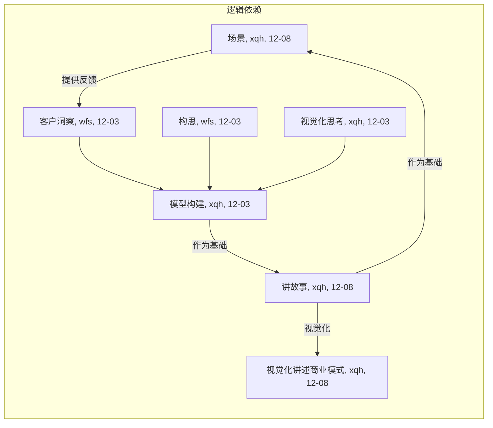

# Lab3-商业模式设计

[TOC]

## 商业模式设计简介

### 组员信息

| 姓名   | 学号      |
| :----- | :-------- |
| 熊丘桓 | 201250172 |
| 孙立帆 | 201250181 |
| 王福森 | 201250185 |
| 蔡之恒 | 201250127 |

### 工作概要<!-- ddl=12-08 -->

<!-- （1）本次作业构建的商业模式必须源于上一次作业，允许有 20% 以下的内容调整；（2）本次作业需要体现出细致的产品设计，不可泛泛而谈；（3）六个设计方法的产物在内容上要一致，六个章节之间需要通过文字描述进行逻辑上的起承转合； -->

### 度量数值<!-- ddl=12-08 -->

<!-- 客户洞察部分的移情图不得少于两个；构思部分的候选创意不得少于三个（不包含最终确定的创意）；模型构建部分更新的画布内总要点数量不少于 30 个，关联关系不少于 15 个；讲故事部分的故事数量不少于两个（至少一个公司视角故事，客户视角故事要源自两个移情图中的一个）；场景部分要点不少于 6 个（了解并评估、购买、获得、交互、售后、评价与可能的再次购买），并简要论述该场景的独特性（与其它竞品相比）。 -->

## 客户洞察<!-- ddl=12-08 -->

<!-- 客户洞察：【至少两个】典型客户群体的移情图（实践中一般为 3 到 5 个）与相关分析说明，需要包含客户针对产品的看、听、想与感受、说与做、痛点、收益六个部分； -->

<!-- 使用 Acrobat 对 pdf 进行编辑，再导出图片【而不是截图】 -->

<!-- 教材 P116-123 -->

### 日常网络交流者

日常网络交流者，即“大众网民”（待扩充）。

#### 统计特征

我国网民总规模9.89亿；收入上，月收入8000以上占14.8%，过半收入超3000；受教育程度，本科率10%左右，绝大多数网民的文化程度不高；职业上，学生、个体户和农民占比高；人口结构上，呈现老龄化趋势；上网时间上，平均每天近4小时。[^wfs-01]

#### 移情图

我国网民数量巨大，由于网络降低了人人互联成本，信息传递十分迅速，也导致互联网潮流语言必将是快速更迭，小宏平时忙于工作，偶尔翻阅朋友圈和知乎，每过一段时间就会冒出一些看不懂的词，每次都得查搜索引擎和各大网站来紧跟潮流，感觉需要花费较大力气跟上互联网。同时互联网说谎话没代价，很多人自称高学历，是不是 copy 一首诗词歌赋发到朋友圈，显得自己有文人风骨，小宏就经常看到小宇在朋友圈发一些自己看不懂的诗词，还总是听到自己妈妈夸小宇，感觉很不是滋味。虽然自己可以也 copy 一篇发到朋友圈，但是怕自己朋友倒时候问自己自己答不上来。小宏毕业后很少写文章，平时说话也少，上网时间也越来越多，导致”失语症“愈发严重。Get-It 平台可以很好的解决小宏的问题，不用花很大力气就能了解最新网络用语、输入意思即可获得相关诗词歌赋、输入模糊意思即可得到文笔优美的句子等等。

### 宣传工作者

宣传工作者，包括自媒体人、企业宣传工作者等（待扩充）。

#### 统计特征

我国自媒体人生产内容以图文为主，约占80%，从业人数超260万，从业人员主要为30岁以下的年轻人，超8成自媒体人学历为专科和本科，学历较高，但从事自媒体行业年限较短，超8成低于两年。

#### 移情图

Get-It 平台可以根据输入的模糊意向得到相应的文章或句子，自媒体从业者可以从这些文章中学习语用，并且部分摘抄到自己的文章中，以此来润色文章。自媒体从业者还可以在平台上搜索相关的网络流行语言，理解其意思并且运用到文章中，使得文章更加接地气。自媒体从业者还能从平台上获得相关内容的大量优质图片，不必在苦于花费大量时间在浩如烟海的互联网中搜寻。

### 书面写作者

书面写作者，包括新闻工作者、秘书、出版社工作人员、文艺创作者等（待扩充）。

#### 统计特征

我国秘书行业从业人员已经超过2000万，但是80%以上的秘书没有受过专门培训。职场上的秘书分为三个层级，普通秘书收入约2000-4000元左右，总经理秘书约5000元，而外企公司总裁办公室高级秘书的月薪大约在8000元到1万元之间。[^wfs-02]

#### 移情图

目前书面工作者普遍没有接受过专门的培训，文笔功底有待提升，素材收集能力也有发展空间。Get-It 平台可以陪伴书面工作者度过最艰难的入门时刻，这个阶段书面工作者苦于提升文笔，润色特定主题的文章，为文稿搜集素材，Get-It 平台正好可以为他们提供相关主题的文章来学习或引用，提高高质量图文和诗文来润色文章，帮助他们获得领导的青睐。

## 构思<!-- ddl=12-08 -->

<!-- 构思：【至少三个】候选商业模式创意（实践中一般为 5 到 8 个），以及最终确定的商业模式创意（筛选或整合得到），每个候选或确定的创意需包含驱动因素、“如果…会怎样”问题、以及创意对整个商业模式画布的影响； -->

<!-- 教材 P124-135 -->

### 创意一：

#### 驱动因素

#### What if 问题

#### 创意影响

### 创意二：

#### 驱动因素

#### What if 问题

#### 创意影响

### 创意三：

#### 驱动因素 客户驱动

#### What if 问题

如果我们为用户提供自动润色文章的工具会怎么样？

可以从目标客户的移情图分析中得知，我们的用户使用 Get-It 平台除了愿意借用这个社区分享高质量图文外，还有一部分需求是对自己写的文章中的部分语句进行替换，换成高质量图文，以此达到润色文章的目的。既然如此我们为何不可直接为用户提供自动润色文章的工具，这将省去用户很大一部分精力，为用户提供更加遍历的平台，提高用户对自身需求满足的可获得性。

对此我们的价值主张将多一项：为用户提供自动润色文章的功能；客户关系的自动化服务程度将大大提升；收入来源将增加一项：自动润色文章使用费；关键活动将多一项：自动润色文章的 NLP 模型开发；成本结构将增加一项：开发自动润色文章的 NLP 模型费用。

#### 创意影响

## 视觉化思考<!-- ddl=12-08 -->

<!-- 视觉化思考：一张视觉化的商业模式画布（参考教材 147 页）与相关分析说明，画布应源于一同提交的【视觉化讲述商业模式的作业】 -->

<!-- 教材 P136-149 -->

<!-- Lecture-13 Page 9 -->

### 视觉化的商业模式画布

### 分析说明

## 模型构建<!-- ddl=12-08 -->

<!-- 模型构建：更新过的商业模式画布与相关分析，需包含粗略的市场潜力预估、画布中各个模块之间的联系、以及支撑画布构建的基本事实（可引用上次作业的相关内容）；更新的画布内总要点数量不少于 30 个，关联关系不少于 15 个 -->

<!-- 教材 P150-159 -->

### 更新过的商业模式画布

### 市场潜力预估

新的商业模式画布在旧画布的基础上进行了不超过 30% 的修改，借用商业模式评估和蓝海战略等分析探究手段，力争从设计上减少成本并提高收益，增加商业模式的稳定性和灵活性，降低了商业模式的经营负担。

### 模块联系

经过上次作业蓝海战略的探究，我们选择新加入“**社交媒体**”作为关键合作的一部分，加入“**工具使用费**”作为收入来源的一部分。并删除原画布中的收入来源要点“**广告费**”。

我们尝试开展与社交媒体的深度合作，这有利于捕捉流行于社交媒体的网络表达素材内容。因此，我们在重要合作中添加了社交媒体部分，以期助推 Dark Mode 网络流行工具集开发。

我们在以上的工作中分析认为，软件平台开发和搜索引擎推荐算法研发在我们的产品项目中占据重要地位，作为我们的核心知识产权，这些工具可以作为产品的一部分，出租或销售给其他有需要的企业或单位使用，收入工具使用费，增加收入来源。

根据网络广告市场的调研报告[^xqh-17]，中小互联网企业的流量入口很难吸引广告费作为成规模的收入，因此我们在修改商业模式时将广告费不再作为主要的收入来源。

我们在上次作业的 [3.2.1.1 基础设施优势/劣势评估](#基础设施优势/劣势评估) 分析得出，我们如果扩展并加深与素材资源版权方的联系，有利于软件平台开发、维护和升级的顺利进行；依托版权方提供的大量资源，我们可以顺利度过高质量图文原始积累的“冷启动”时期，并在启动十七过后持续帮助资源内容进行迭代。该合作的顺利进行，将进一步丰富我们的知识性资源和素材资源。

### 支撑画布构建的基本事实

支撑画布构建的基本事实参见上次作业的 [2. 商业模式环境]()

## 讲故事<!-- ddl=12-08 -->

<!-- 讲故事：围绕【模型构建】中的【画布】编写至少一个源自大作业团队（公司）视角的故事，以及至少一个源自客户视角的故事，故事中需指明与画布中模块的对应关系； -->

<!-- 教材 P160-179 -->

### 团队视角

### 客户视角

## 场景<!-- ddl=12-08 -->

<!-- 场景：针对【讲故事】中的【客户视角故事】设置客户与产品交互的场景，需体现出客户如何了解并评估产品、购买并获得产品、与产品交互、以及产品售后、客户对产品的评价与再次购买，建议突出场景与客户的连接（场景 IP+场景分发）；要点【不少于 6 个】（了解并评估、购买、获得、交互、售后、评价与可能的再次购买），并简要论述该场景的独特性（与其它竞品相比） -->

<!-- 教材 P170-185 -->

[^wfs-01]:[中国近10亿网民，本科率只有4％？大多数网民收入在这个水平_腾讯新闻](https://new.qq.com/rain/a/20210423A00G9X00#:~:text=那么网民收入结构如何？,据统计，我国网民已达9.89亿。 月收入8000多元占14.8%，约1.46亿。)
[^wfs-02]:[秘书行业现状|秘书|现状-人人范文网 (inrrp.com.cn)](https://www.inrrp.com.cn/html/1a1a5ae24cda6e44.html)