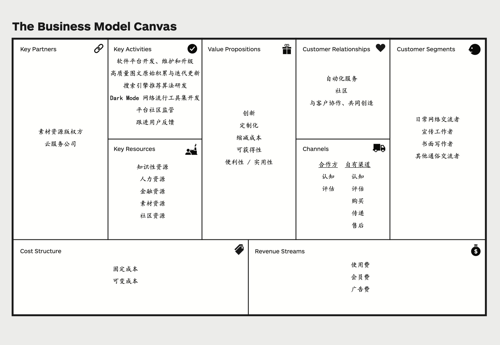

# lab1-项目启动 实验报告

## 1. 项目总览

### 1.1 项目选题

我们小组致力于研发一款高质量的图文素材推荐平台 —— Get-It。

### 1.2 组员信息

|姓名|学号|
|:----|:----|
|熊丘桓|201250172|
|孙立帆|201250181|
|王福森|201250185|
|蔡之恒|201250127|

### 1.3 度量数值

本文档共包含了 33 个要点与 12 条关联关系。平均要点数量为 4.22 个。

要点的联系详见第四部分，每个联系之前有要点位置的标注，例如 3.2.1.1 表示关键业务的第一小点（软件平台开发、维护和升级）。

## 2. 项目简介

> 是否还在为朋友圈没有合适的文案而秃头？
>
> 是否还在羡慕好友微博里好看的配图？
>
> 做 Pre 怎么也找不到合适的素材？
>
> 网络时代无法与“梗小鬼”或“抽象战神”交流？

网络时代，“失语症”现象愈发严重。为方便用户丰富表达内容和形式、获取表达素材与手段，小组致力于研发的 Get-It 项目以高质量的图文推荐引擎为核心，以社区功能和其他实用小工具为辅助，希望帮助用户破除“现代失语症”的限制。

平台的绝对核心是一款高质量的图文推荐引擎，用户输入想要表达的内容、主题、关键字，推荐引擎通过智能 AI 算法，推荐高质量的图片或文字。为帮助用户精准定位需求，平台分别制作文字推荐和图片推荐页面，用户还可部分自定义内容倾向性。例如，在文字推荐引擎中，用户输入一个意象，平台可能会智能推荐相应的诗词、名著文段、名人名言等；在图片推荐引擎中，用户输入一个主题，平台可能会推荐相应的图标（icon）、表情包、矢量图等。平台推荐结果主打高质量，期望推荐的结果可以直接用于朋友圈文案、幻灯片制作、公文写作等场合。

沟通与理解是双向的，用户在输出自身观点的同时也在输入他人的观点。为增进理解，平台整合以上搜索功能，推出“一键搜索”功能。用户面对晦涩难懂的文字甚至是词不达意的表达，只需键入关键字，平台就会智能推荐近似的文本和图片，促进用户的理解。

今天，造梗和玩梗的速度已达到高峰，为了拓宽用户面、紧跟潮流、保持推荐引擎的时效性，平台也融入了社区模块。该功能可分为两部分，一部分类似于 Wikipedia，鼓励用户提供资源参与平台建设；另一部分则类似于微博或推特，为用户提供一个分享生活的平台。良好的社区氛围会反哺于平台的推广，高素质的用户也会让平台受益良多。两个模块相辅相成，对平台的建立、发展和巩固会起到不可替代的作用。

现代生活，紧张压抑，缺少自由，人们内心积压的情绪无处释放，于是百度贴吧等网络论坛便成为言论“垃圾场”，网络时代聊天抽象程度提高，为了增进用户对新型网络梗的理解，引导用户合理发泄情绪，满足用户一些猎奇、变态却不违背公序良俗的心理，平台特别推出**暗黑模式（Dark Mode）**。

在暗黑模式（Dark Mode）下，搜索引擎的推荐内容从正派、高雅的素材一转变为开放、重口的素材，以满足用户相互理解、网络斗图等需要。平台还计划推出一个工具集（功能待完善），目前包含抽象转换器，可以进行抽象文本和正常文本的双向转化。比如，用户输入 “别在这里发电”，抽象转换器就会输出 “🐢💈”。图片推荐引擎还可推荐二次元图片、重口表情包、emoji 等内容；文字推荐引擎则可推荐网络梗、二次元梗等内容。暗黑模式的社区或许可以称得上“群魔乱舞”，只要不违法或违背公序良俗，用户可在其中畅所欲言。

为了保证纯净模式（Light Mode）（即上文介绍的内容，与暗黑模式相对）的质量，平台会加强监管，防止不合适的内容流入纯净模式的社区。

我们的项目中，**纯净模式**致力于进行高质量素材的内容收集和信息整合，提高用户收集图文素材的效率，为用户能够理解他人、表达心中所想提供支持；**暗黑模式**以同一套技术为网络时代用户适应语言惊人的迭代速度提供支持，引导用户合理发泄情绪。平台始终将帮助用户解决“失语症”放在第一位，为让用户自信说出“I got it” 而不懈努力。

## 3. 商业模式画布与竞品分析

### 3.1 要点概述

### 3.2 要点介绍

#### 3.2.1 关键业务 KA

##### 1. 软件平台开发、维护和升级

Get-It 团队首先需要打造一个向目标客户群体传达价值主张（VP）的软件平台。

**1. 平台开发**

1. 平台需支持 Light Mode 所需的图标、高质量图片、矢量图搜索，诗歌、名人名言、书库搜索；Dark Mode 所需的二次元图片、重口表情包、emoji 搜索，网络梗、二次元梗、奇妙言论等文字搜索的搜索引擎框架。

2. 为增加平台的用户交流，旨在“客户参与创造”，该平台还需开发客户交流社区。该社区支持用户畅所欲言、参与平台建设（上传图片和文字等资源）。

3. 为顺应网络潮流，该平台在 Dark Mode 还应提供网络流行语言工具集，初代版本支持“抽象转换器”。

4. 为不断改善用户体验，平台还应设有用户反馈功能，从用户的视角进一步改善平台。

**2. 平台维护：** 平台需拥有运维团队保证平台的正常运行。

**3. 平台升级：**

1. 内容升级：为顺应社会与网络的发展，平台搜索引擎提供的图片、文字应不断迭代更新，平台提供的网络流行语言工具集也应进一步扩充功能。

2. 用户反馈：Get-It 团队会设立小组跟进用户反馈，评估其合理性，并据此对平台的框架及功能进行调整，让用户参与到平台的建设中。

##### 2. 高质量图片、文字原始积累与迭代更新

**1. 原始积累** 

为了向客户提供高质量的图片和文字，Get-It 平台首先需要大量高质量的图片和文字、网络流行图片和语言作为 Light Mode & Dark Mode 搜索引擎的数据库。因此 Get-It 团队需要对这项资源做原始积累，从各个平台网站上合法获取可商用的图片文字或有版权的网址链接，同时按照类别划分到各个数据库中。

**2. 迭代更新** 

社会与网络世界日新月异，Get-It 平台应紧跟并引领时代潮流，同步更新高质量素材资源。一方面 Get-It 团队背靠各大平台网站，定期整合资源，更新数据库；另一方面在“客户参与创造，用户定义软件”的理念下，Get-It 团队会对客户上传分享的内容进行审核，审核通过即可入库，在 Get-It 社区活跃客户的贡献下，Get-It 平台极有可能成为网络时代潮流的领头羊！

**3.搜索引擎推荐算法研发**

搜索引擎推荐算法的优劣对平台向用户提供内容的质量有决定性作用。为保证输出内容的与类别的贴合性、影响力、时效性，Get-It 平台的搜索引擎以客户输入、类别倾向、近期被采纳数量、入库时间、初始质量等作为参数，通过智能 AI 算法计算被采纳概率，对满足要求的结果降序输出，争取让用户在前 3 项就能说出 “I got it!!!”。

**4. Dark Mode 网络流行语言工具集开发**

Get-It 平台计划为 Dark Mode 开发一个网络流行语言工具集，以方便客户将正常语言转化为网络流行语言。如“抽象转化器”使用户完成从正常人到“抽象战士”的转换，更快地陷入黑暗。Get-It 团队将来会进一步扩充该工具集的内容，旨在让具象的正常人与抽象的网络人无缝衔接。

**5. 平台社区监管**

**1. Light Mode：** Light Mode 社区是一个积极向上的、互助的、正派的社区，但由于有 Dark Mode 的存在，通过监管手段保证 Light Mode 社区的纯净必不可少，为此 Get-It 团队将成立专门的监管部门。Light Mode 社区对用户发表的言论、图片等内容严格审查，所有涉及二次元图片、重口表情包、网络梗、二次元梗、奇妙言论、违法、违反道德伦理等的内容都将永久屏蔽；通过向用户给予警告，进行提示，警告次数达到一定阈值将予以封号处理，严重者将被永久封号。

**2. Dark Mode：** 相较而言，Dark Mode 社区则引导用户发泄情绪，其监管力度较低，内容不违法、违反道德伦理，用户可以畅所欲言，但处罚的力度和 Light Mode 一致。

**6. 跟进用户反馈**

Get-It 团队设立反馈小组，对收集到的用户反馈进行分析和处理，从提升平台体验、提升推荐引擎的准确性等多个维度进行优化，增进用户体验。

##### 竞品分析

* **西窗烛：** **1. 联系：** Get-It 平台和西窗烛 APP 均有“软件平台开发、维护和升级”、“平台社区监管”、“跟进用户反馈”、“搜索引擎推荐算法开发”，“素材原始积累”

**2. 区别：**

1. 素材原始积累：西窗烛 APP 体裁有限，只有诗词歌赋、文学作品，而 Get-It 平台所提供素材内容更加丰富，包括高质量图片、诗词歌赋、成语、表情包等。

2. 平台社区监管：由于西窗烛 APP 主营诗词歌赋，相比于 Light Mode 社区和 Dark Mode 社区用户群体体量较少，而且用户质量较高，不容易出现发表内容违法或违反道德伦理等现象，监管压力较小；而 Get-It 社区体量较大，用户素质参差，引入监管更为关键。

3. 搜索引擎推荐算法：西窗烛 APP 目标用户是诗文爱好者，他们使用改搜索引擎意在对词句进行定位和精确查找；但 Get-It 平台旨在发掘、展示能够表达用户想法的素材，支持模糊搜索等功能。可见 Get-It 平台的搜索引擎推荐算法与西窗烛 APP 是不一样的，其算法设计也天差地别。  

* **WantWords** **&** **WantQuotes：**
**1. 联系：**Get-It 平台和 WantWords & WantQuotes 平台均有“平台开发、维护和升级”、“原始素材积累”、“搜索引擎推荐算法开发”、“跟进用户反馈” 活动。

**2. 区别：**Get-It 平台拥有社区资源，故需要对其进行监管，而 WantWords & WantQuotes 没有社区功能，故没有“平台社区监管”活动；同时 WantWords & WantQuotes 也没有“网络流行语言工具集开发”活动。

#### 3.2.2 重要合作 KP

##### 1. 与图片、诗歌、文章等素材资源的**版权方合作**

Get-It 平台获得的各种素材资源可能是有版权的，通过与版权方合作，筛选更多素材资源，实现共赢。一方面版权方通过本平台可获得更多流量，另一方面本平台可以收取推广费。

##### 2. 与**云服务公司**建立合作关系

Get-It 平台的正常运行离不开底层物理设备和大型数据库等软件的支持。为专注于帮助用户解决“现代失语症”，让用户说出“I got it!”，Get-It 团队选择与云服务公司合作，将平台的运行环境和网络环境等外包给云服务公司，站在他们的肩膀上打造 Get-It 平台。

##### **竞品****分析**

* **西窗烛：**
**1. 联系：**Get-It 平台和西窗烛 APP 均需要和云服务公司建立合作关系，以支持软件平台的运行和素材资源的存储。

**2. 区别：**西窗烛 APP 所提供的素材资源是中国传统诗文，这些资源作为传统文化成果可免费商用；而 Get-It 平台存在与版权方的合作。

* **WantWords** **&** **WantQuotes：**
**1. 联系：**WantWords & WantQuotes 作为清华大学自然语言处理与社会人文计算实验室的一个项目，目前的商业属性还不成熟，因此重要合作几乎没有。

**2. 区别：**

1. 云服务公司：由于 Get-It 平台有社区功能，多用户并发给服务器造成压力比 WantWords & WantQuotes 这类功能性产品大得多，故需要外包云服务公司支持平台的运行，而 WantWords & WantQuotes 可能不需要依靠其他合作伙伴解决平台运行的问题。

2. 版权方合作：目前 WantWords & WantQuotes 暂不用于商用，故其涉及的内容没有版权问题，而 Get-It 平台的素材资源可以与版权方合作。

#### 3.2.3 核心资源 KR

##### **1. 知识性资源**

Get-It 团队自研的搜索引擎推荐算法是本平台为用户提供高质量图文的核心，Get-It 团队将花费足够的精力来打造一个能够让用户说出"I got it!"的搜索引擎，该搜索引擎推荐算法也将是 Get-It 团队最重要的资源。

##### **2. 人力资源**

Get-It 团队拥有平台开发运维人员、搜索引擎推荐算法开发人员、素材搜索人员、平台监管人员等人力资源。

##### **3. 金融资源**

Get-It 平台前期需要一定规模的金融资源来进行推荐算法的开发、软件平台的开发、素材资源的原始积累等工作，当平台开始投入使用后金融资源便不再是核心资源。

##### **4. 素材资源**

Get-It 平台的高质量图片、诗歌、表情包等素材资源是为用户提供高质量内容的基础，是必不可少的核心资源。

##### **5. 社区资源**

通过一段时间的推广，Get-It 社区积累的高质量活跃用户将构成重要的社区资源。社区用户在分享自己的素材资源并从平台获取积分、发表自己的看法的同时，也在不断扩充平台的素材资源、不断吸引更多用户加入 Get-It 社区，营造更加良好的社区氛围。当客户看到自己上传的的素材资源被频频引用，其为平台做出更多贡献的欲望被激发，如此往复，良性循环，Get-It 社区发展愈发壮大。

##### **竞品****分析**

* **西窗烛：**
**1. 联系：**Get-It 平台和西窗烛 APP 都拥有“人力资源”、“素材资源”、“社区资源”。

**2. 区别：**

1. 金融资源：Get-It 平台相比于西窗烛 APP 在早期更需要“金融资源”来搜罗整合高质量的素材，后者的资源已经非常完善，有非常成熟的获得渠道。

2. 素材资源：西窗烛 APP 的素材资源都是经典的诗词歌赋，相对静态；而 Get-It 平台的素材资源随着时代潮流不断更新迭代，同时会吸纳用户贡献高质量素材，相对动态。

3. 知识性资源：Get-It 平台的资源搜索引擎推荐算法能够解决用户的“现代失语症”，让用户说出"I got it!"，这项是 Get-It 平台独有的。

* **WantWords** **&** **WantQuotes：**
**1. 联系：**Get-It 平台和 WantWords & WantQuotes 均有“知识性资源”、“人力资源”和“素材资源”，且以搜索引擎推荐算法为核心的“知识性资源”都是产品核心资源中的核心资源。

**2. 区别：**

1. 由于 Get-It 平台原始积累素材的种类繁多，商业软件平台的开发复杂等因素，Get-It 平台还有“金融资源”，而 WantWords & WantQuotes 是一款实验室产出的产品，其创作团队都是技术型人才，加之其研究属性，WantWords & WantQuotes 不太需要“金融资源”。

2. Get-It 平台还有 WantWords & WantQuotes 没有的“社区资源”。

#### 3.2.4 成本结构 C$

1. 固定成本
* 产品上线之前需要投入开发成本，具体包括产品开发人员的成本、初期市场调研的成本等。
* 提供线上服务的成本，包括服务器和数据库的使用成本等。该项成本在规模扩大到一定阈值后会成为可变成本。
2. 可变成本
* 产品上线后的运行维护成本。
* 用于推广的产品营销费用。
* 可能产生的资源版权购买或租赁费用。
* 用于管理社区的费用。
##### 竞品分析

WantWords 和 WantQuotes 作为清华大学自然语言处理与社会人文计算实验室的实验性项目，最主要成本为 AI 算法研发成本。

西窗烛的成本主要由以下几部分构成：

* 开发费用：产品本身的开发费用。
* 管理维护费用：包括软件数据库维护的成本和社区的维护成本。
* 版权费用：产品使用了部分其他组织或个人的知识产权内容，该产品需要对这些内容付费。
* 营销费用：产品在各大平台投放广告等营销手段产生的费用构成产品成本的重要部分。
#### 3.2.5 收入来源 R$

1. 使用费
本产品向用户提供搜索引擎作为服务内容，但此项基础服务并不面向用户收费。

2. 会员费
本产品对于深度使用或有高水平需求的的用户提供会员服务，包括提供更多优质素材、去除广告等。

3. 广告费（推广费）
本产品与 iconfont、西窗烛、WantWords 等项目进行合作，相互推广，并收取一部分推广费。该项目本身作为引流手段，可以为其他产品和服务提供广告推广服务，并收取部分广告费。

##### 竞品分析

WantWords 和 WantQuotes 不对公众收费。

西窗烛的收入主要由以下几部分构成：

* 会员会费：用户可选择向产品支付会费成为会员以解锁更多功能。
* 周边销售：西窗烛销售其周边的文创产品，作为收入的一部分。
#### 3.2.6 客户关系 CR

1. 自动化服务
平台提供简单易用的搜索和推荐服务，使用方式类似于传统的搜索引擎，用户不需要额外的知识即可完成服务的使用。

2. 社区
为用户提供了交流互动和分享内容的社区，有 Light Mode 和 Dark Mode 两种模式，其中 Light Mode 是日常向的、正经的社交平台性质的社区；Dark Mode 是面向网上冲浪重度用户、抽象老哥的社区，内容比较自由。用户可以根据需要开启或关闭 Dark Mode。

3. 与客户协作、共同创造
鼓励用户分享内容（带上 tag 的图片），对于高质量的内容或者用户多次下载的内容，分享的用户可以获得积分奖励，积分可以用于购买平台内的商品或服务。

##### 竞品分析

**WantQuotes****&****WantWords** 

* 联系：提供的主要服务类似搜索引擎的用法，流程高度自动化。
* 区别：WantQuotes & WantWords 主要作为一个工具性的平台，不具有社区的属性，用户也无法参与平台内容的贡献；而Get-It 拥有面向不同群体的社区，用户可以进行分享和交流讨论，且可以通过分享图文资源参与平台内容的贡献。
**西窗烛**

* 联系：也提供简单易用的搜索服务，流程自动化；也有开放的社区，供用户交流和分享内容。
* 区别：平台是内容的提供者，拥有诗文内容的庞大数据库，用户虽然也会在社区分享自己创作的内容但并不参与平台服务内容的创作；Get-It 鼓励用户分享资源参与平台内容建设。
#### 3.2.7 客户细分 CS

##### 求同存异的客户群体：

1. 日常网络交流者：朋友圈、微博、QQ 空间等。
2. 宣传工作者：公众号文案、演讲稿、海报制作等。
3. 书面写作者：公文、信件等。
4. 其他通俗交流者：水群、玩梗等。
##### 竞品分析

**WantsQuotes****&****WantWords**

* 联系：都面向想要以更合适的形式呈现自己的表达内容的用户。
* 区别：WantQuotes & WantWords 面向的是大众市场，没有提供差异化的服务；而 Get-It 面向求同存异的客户群体，面向不同的客户群体，根据需求提供略有差异的服务（比如 2，3 一般使用 Light Mode, 而 1，4 则很可能会是 Dark Mode 用户），而且相比于 WangQuotes & WantWords 只提供文字内容，Get-It 包含了文字资源和图片资源的检索和推荐，对需要同时准备图文内容的客户群体更加友好（比如宣传工作者）。
**西窗烛**

* 联系：都可以面向想要以更合适的形式呈现自己的表达内容的用户。
* 区别：西窗烛面向大众市场，没有细分客户群体提供差异化的服务，且主要面向的群体还是诗文爱好者；而 Get-It 面向求同存异的客户群体，面向有不同需求的客户群体提供差异化的服务，而且 Get-It 提供的资源更现代化，更丰富，也更符合当前时代的大部分客户群体的实用需要。
#### 3.2.8 价值主张 VP

1. 创新
* 目前大多数用户在需要一些图文内容的时候主要使用搜索引擎（比如 Google、bing）来查找，查找的结果内容非常多但是一些排在前面的内容可能质量并不高或者不相关，用户可能需要浏览很多内容才能找到比较合适的结果。本平台通过针对特定场景（即网络交流、宣传工作、书面写作、其他通俗交流等）的搜索和推荐算法，为用户呈现筛选过的，质量更高更合适的内容，减少用户的工作量。
* 目前也有一些小工具或者程序针对查找合适图文的需求（比如竞品），但是大多是只针对图片或者文本，本平台集成了文本和图片的服务，为准备图文内容的用户提供更完整的体验。
2. 定制化
* 用户可以通过选择关心的主题或者切换模式（Light Mode & Dark Mode) 来选择自己平台主页推送的内容。
3. 缩减成本
* 减少了用户在大量的搜索结果中挑选内容的时间，缩减了用户的时间成本。
4. 可获得性
* 以往有准备图文内容需求的用户可能不知道要去哪里寻求支持或者需要跨多个平台才能满足他的需求，且可能需要大量浏览内容挑选，可能很多用户没有足够的耐心或者时间。本平台提供简单易用的搜索推荐服务，可以让有需求的用户都可以轻松地上手使用，降低了门槛。
5. 便利性/实用性
* 使用的方式类似于传统的搜索引擎，用户使用起来很方便。
* 呈现筛选过的内容，用户挑选起来更方便，具有实用性。
##### 竞品分析

**WantQuotes****&****WantWords**

* 联系：价值主张都具有新颖性，提供了从前没有的体验（据意查图/文）；都具有可获得性和实用性/实用性，此前用户如果想要据意获得准确的图/文可能要使用搜索引擎查找之后再繁多的内容中挑选，再结合自己的想法才能得到准确的表达，而使用 WantQuotes & WantWords 和 Get-It 用户可以轻松地完成这个过程。
* 区别: 相比于 WantQuotes & WantWords 来说，Get-It 在新颖性上更进一步，在内容上包括了图片和网络时代的语言，更加贴合时代潮流；相比于 WantQuotes & WantWords，Get-It 还具有定制化的属性，用户可以根据自己的需求定制呈现的内容。
**西窗烛**

* 联系：都提供简单易用的检索推荐服务，减轻了用户原本繁重的检索和挑选工作，具有便利性和实用性；都把某些产品和服务提供给了之前可能接触不到的用户，具有可获得性，比如西窗烛提供的较为全面的诗文库检索，Get-It 提供的精选的图文推荐服务，在此前用户可能都难以接触该类服务或者成本较高。
* 区别：相比于西窗烛，Get-It 在新颖性上更胜一筹，在内容上更加新潮，同时在检索的基础上还有推荐，进一步提升了用户体验；同时，和西窗烛相比，缩减用户日常沟通表达的时间成本也是 Get-It 的价值主张之一，具有更强的实用性； Get-It 还具有更高的定制化程度，不同用户群体可以根据需要参与自己主页呈现内容的定制。
#### 3.2.9 渠道通路 CH

1. 合作方
2. **认知**
* 可以和一些有一定影响力的个人（如 B 站 UP 主）合作推广。
2. **评估**
* 邀请用户（开始可以主要考虑工作中需要图文内容准备的用户，比如宣传工作者）免费体验平台的服务并分享使用体验，平台给予一定的激励。
2. 自有渠道
3. **认知**
* 制作官方网站，方便用户更好地了解我们的服务。
* 在一些社交平台如知乎、贴吧、微博等运营官方的账号来进行推广，帮助更多用户了解我们的服务。
* 引入用户邀请机制，新用户注册的时候可以填写老用户的邀请码，新老用户都可以获得一定的积分奖励，以这种方式来吸引更多新用户。
2. **评价**
* 建立反馈机制，定时了解用户对我们的产品服务和价值主张的评估。
3. **购买**
* 新用户注册后有一定的初始积分，用户还可以通过签到、邀请新用户、分享内容、付费等方式获得积分。积分可以用于购买平台的商品和服务。
* 部分功能（如搜索）有免费模式和 VIP 模式，VIP 模式使用更精细的推荐算法。
4. **传递**
* 付出积分之后即可使用服务。
5. **售后**
* 人工客服和智能客服系统收集用户的反馈，解决用户关于产品和服务的问题。
##### 竞品分析

**WantQuotes & WantWords**

* 联系：WantQuotes & WantWords 是偏研究性质的工具性产品，并没有在渠道通路上花精力，因此没有什么联系。
* 区别：WantQuotes & WantWords 没有在渠道通路上花费太多精力，目前客户对产品的认知途径主要是口口相传，用户访问平台网站来使用服务；Get-It 通过自有渠道和合作方两个渠道来向客户传递我们的价值主张，提供产品和服务以及完善的售后服务。
**西窗烛**

* 联系：都有合作方和完整的自有渠道来向客户传递价值主张，提供产品服务和售后服务。
* 区别：除了官方网站、商务合作、媒体报道之外，西窗烛缺乏在新媒体平台（比如知乎、b 站）上的官方运营账号来提升潜在用户对群体的认知（特别是年轻人）；而 Get-It 以在知乎、b 站等新媒体平台上运营的官方账号为提高产品和服务认知度的手段之一，可以更好地吸引年轻的潜在用户群体。
## 4. 要点关联

1. 3.2.1.1（软件平台开发、维护和升级）、3.2.1.2（高质量图片、文字原始积累与迭代更新）、3.2.1.3（搜索引擎推荐算法研发）、3.2.7.2（宣传工作者）、3.2.7.3（书面写作者）平台为高质量图文需求用户提供了优质的资源。
2. 3.2.1.1 （软件平台开发、维护和升级）、3.2.1.2（高质量图片、文字原始积累与迭代更新）、3.2.1.4（Dark Mode 网络流行语言工具集开发）、3.2.7.1（日常网络交流者）、3.2.7.4（其他通俗交流者）平台为用户理解网络语言提供了支持与帮助。
3. 3.2.1.1 （软件平台开发、维护和升级）、3.2.1.2（高质量图片、文字原始积累与迭代更新）、3.2.2.1（与图片、诗文等素材资源的版权方合作）、3.2.3.4（素材资源）利于盘活现有资源，进行借势营销，提升平台推荐质量。
4. 3.2.2.1（与图片、诗文等素材资源的版权方合作）、3.2.5.3（广告费（推广费））在获得收入的同时丰富平台资源，增进用户体验。
5. 3.2.1.1（软件平台开发、维护和升级）、3.2.2.2（与云服务公司建立合作关系）、3.2.4.1（固定成本）、3.2.4.2（可变成本）保障了平台运行的基础。
6. 3.2.1.2（高质量图片、文字原始积累与迭代更新）、3.2.6.3（与客户协作、共同创造）、3.2.7.1（日常网络交流者）、3.2.7.4（其他通俗交流者）、3.2.8.5（便利性 / 实用性）、3.2.9.2（自有渠道）发挥强大的社会效应，引导互联网文化的传播和迭代，助力风清气正的网络建设，起到激浊扬清的示范作用。
7. 3.2.1.1（软件平台开发、维护和升级）、3.2.1.4（Dark Mode 网络流行语言工具集开发）、3.2.1.5.2（Dark Mode 社区监管）、3.2.3.5（社区资源）、3.2.6.2（社区）、3.2.7.4（其他通俗交流者）为引导用户合理发泄情绪，满足用户一些猎奇、变态却不违背公序良俗的心理提供平台。
8. 3.2.5.1（使用费）、3.2.5.2（会员费）、3.2.6.1（自动化服务）、3.2.7.2（宣传工作者）、3.2.7.3（书面写作者）构成平台主要盈利途径，支撑平台正常运行。
9. 3.2.1.3（搜索引擎推荐算法研发）、3.2.3.1（知识性资源）、3.2.8.1（创新）、3.2.8.4（可获得性）、3.2.8.5（便利性 / 实用性）、3.2.9.2.2（评价）智能 AI 算法为高质量图文推荐提供核心支持，持续提升品牌口碑和知名度。
10. 3.2.1.1.3（平台升级）、3.2.1.2.2（迭代更新）、3.2.1.6（跟进用户反馈）践行了“用户定义软件”的平台宗旨，平台不断吸纳用户群体的反馈，持续改善服务、提升质量。
11. 3.2.1.1.3（平台升级）、3.2.3.5（社区资源）、3.2.6.2（社区）、3.2.6.3（与客户协作、共同创造）、3.2.8.2（定制化）、践行了“客户参与创造”的平台宗旨，鼓励用户不断参与平台贡献，提升用户参与感和归属感。
12. 3.2.1.1（软件平台开发、维护和升级）、3.2.1.2.1（原始积累）、3.2.1.3（搜索引擎推荐算法研发）、3.2.2.2（与云服务公司建立合作关系）、3.2.3.3（金融资源）、3.2.4.1（固定成本）、3.2.4.2（可变成本）构成了平台启动所需的资本要素。

